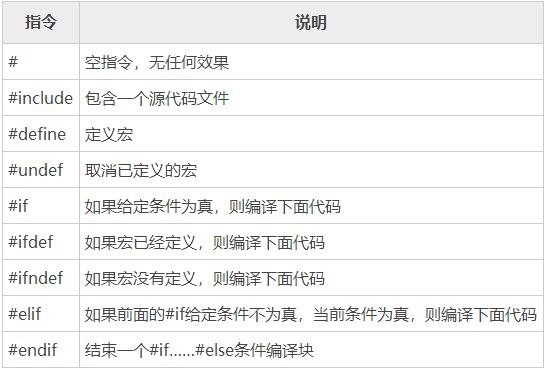

# 第一章 初识C++


## 1.1 C++的诞生


C++（c plus plus）是一种计算机高级程序设计语言，由[C语言](https://baike.baidu.com/item/C语言/105958?fromModule=lemma_inlink)扩展升级而产生 ，最早于1979年由[本贾尼·斯特劳斯特卢普](https://baike.baidu.com/item/本贾尼·斯特劳斯特卢普/10613051?fromModule=lemma_inlink)在AT&T贝尔工作室研发。

C++既可以进行C语言的过程化[程序设计](https://baike.baidu.com/item/程序设计/223952?fromModule=lemma_inlink)，又可以进行以[抽象数据类型](https://baike.baidu.com/item/抽象数据类型/3227531?fromModule=lemma_inlink)为特点的基于对象的程序设计，还可以进行以继承和多态为特点的面向对象的程序设计。C++擅长面向对象程序设计的同时，还可以进行基于过程的程序设计。 C++几乎可以创建任何类型的程序：游戏、[设备驱动程序](https://baike.baidu.com/item/设备驱动程序/310766?fromModule=lemma_inlink)、[HPC](https://baike.baidu.com/item/HPC/16007677?fromModule=lemma_inlink)、[云](https://baike.baidu.com/item/云/2363180?fromModule=lemma_inlink)、[桌面](https://baike.baidu.com/item/桌面/4773626?fromModule=lemma_inlink)、[嵌入式](https://baike.baidu.com/item/嵌入式/575465?fromModule=lemma_inlink)和[移动应用](https://baike.baidu.com/item/移动应用/4781098?fromModule=lemma_inlink)等。 甚至用于其他[编程语言](https://baike.baidu.com/item/编程语言/9845131?fromModule=lemma_inlink)的库和[编译器](https://baike.baidu.com/item/编译器/8853067?fromModule=lemma_inlink)也使用C++编写。

C++拥有计算机运行的实用性特征，同时还致力于提高大规模程序的编程质量与程序设计语言的问题描述能力。


## 1.2 发展历程


- 1970年，AT&T贝尔实验室的工作人员D.Ritchie和K.Thompson共同研发了C语言。研制C语言的初衷是用它编写UNIX系统程序，因此，实际上C语言是UNIX的“副产品”。

- 1971年，瑞士联邦技术学院N.Wirth教授发明了第一个结构化的编程语言[Pascal](https://baike.baidu.com/item/Pascal/241171?fromModule=lemma_inlink) 

- 20世纪70年代中期，本贾尼·斯特劳斯特卢普在剑桥大学计算机中心工作。斯特劳斯特卢普希望开发一个既要编程简单、正确可靠，又要运行高效、可移植的计算机程序设计语言。而以C语言为背景，以[Simula](https://baike.baidu.com/item/Simula/6913723?fromModule=lemma_inlink)思想为基础的语言，正好符合斯特劳斯特卢普的初衷和设想。 

- 1979年，本贾尼·斯特劳斯特卢普到了AT&T贝尔实验室，开始从事将C改良为带类的C（C with classes）的工作。

- 1983年，该语言被正式命名为C++。 

- 1985年、1990年和1994年，C++先后进行3次主要修订。C++的标准化工作于1989年开始，并成立了一个[ANSI](https://baike.baidu.com/item/ANSI/10401940?fromModule=lemma_inlink)和ISO（International Standards Organization）国际标准化组织的联合标准化委员会。

- 1994年1月25曰，联合标准化委员会提出了第一个标准化草案。在该草案中，委员会在保持斯特劳斯特卢普最初定义的所有特征的同时，还增加了部分新特征。在完成C++标准化的第一个草案后不久，亚历山大·斯特潘诺夫（[Alexander Stepanov](https://baike.baidu.com/item/Alexander Stepanov/9703963?fromModule=lemma_inlink)）创建了标准模板库（Standard Template Library，STL）。在通过了标准化第一个草案之后，联合标准化委员会投票并通过了将STL包含到C++标准中的提议。STL对C++的扩展超出了C++的最初定义范围。虽然在标准中增加STL是个很重要的决定，但也因此延缓了C++标准化的进程。

- 1997年11月14日，联合标准化委员会通过了该标准的最终草案。 

- 1998年，C++的ANSI/IS0标准被投入使用。


## 1.3语言标准


美国国家标准委员会(ANSI)在1990年成立委员会，后来国际化标准组织ISO也通过其委员会加入这个行列。他们组成ANSI/ISO组织，专门致力于制定C++标准。

现已发布和计划中的标准如下：

1998年制定出的第一个C++标准ISO/IEC 14882:1998。通常被称为C++98，它不仅描述了已有的C++特性，还对该语言进行了扩展，添加了异常、运行阶段识别符(RTTI)、模板和标准模板库(STL)。2003年，发布了第二个C++标准ISO/IEC 14882:2003。这个版本的是一次技术性修正，对第一版进行了整理、修订错误、减少多义性等，但是没有改变语言特性。这个版本通常被称为C++03。由于没有改变语言特性，一般用C++98表示C++98/C++03。

#### C++11标准

 ISO标准委员会在2001年8月批准了新的标准C++11 ISO/IEC 14882:2011。C++11在C++98的基础上增加了许多新特性。其目标是消除不一致性，让C++学习和使用更加容易。

#### C++14标准

 C++标准第四版，2014年8月18日发布。正式名称为ISO/IEC 14882:2014 。2014年8月18日，ISO组织在其网站上发布文章称：“C++ 作者 Bjarne Stroustrup 称，主要的编译器开发商已经实现了 C++ 14 规格”。C++ 14 是 C++ 11 的增量更新，主要是支持普通函数的返回类型推演，泛型 lambda，扩展的 lambda 捕获，对 constexpr 函数限制的修订，constexpr变量模板化等等。C++14是C++语言的最新标准，正式名称为"International Standard ISO/IEC 14882:2014(E) Programming Language C++"。C++14旨在作为C++11的一个小扩展，主要提供漏洞修复和小的改进。C++14标准的委员会草案（Committee Draft）N3690于2013年5月15日发表。工作草案（Working Draft）N3936已于2014年3月02日完成。最终的投票期结束于2014年8月15日，结果（一致通过）已于8月18日公布。

#### C++17标准

 C++17 是继 C++14 之后，C++ 编程语言 ISO/IEC 标准的下一次修订的非正式名称。在2017年10月，ISO C++ 委员会正式发布了 C++ 17 标准，官方名称为 ISO/IEC 14882:2017。基于 C++ 11，C++ 17 旨在使 C++ 成为一个不那么臃肿复杂的编程语言，以简化该语言的日常使用，使开发者可以更简单地编写和维护代码。

#### C++20标准

 ISO C++委员会在2020年12月正式发布了 C++20 标准，命名为 ISO/IEC 14882:2020。C++ 之父 Bjarne Stroustrup 表示：“C++ 20是自C++11以来最大的发行版，它将是C++发展史上的里程碑。” c++20引入了更多特性，以更简单地编写和维护代码。

#### C++23标准

 下一代开发中的标准。


## 1.4语言特点


#### 与C语言的兼容性

C++与C语言完全兼容，C语言的绝大部分内容可以直接用于C++的程序设计，用C语言编写的程序可以不加修改地用于C++。

#### 数据封装和数据隐藏

在C++中，类是支持数据封装的工具，对象则是数据封装的实现。C++通过建立用户定义类支持数据封装和数据隐藏。 

在面向对象的程序设计中，将数据和对该数据进行合法操作的函数封装在一起作为一个类的定义。对象被说明为具有一个给定类的变量。每个给定类的对象包含这个类所规定的若干私有成员、公有成员及保护成员。完好定义的类一旦建立，就可看成完全封装的实体，可以作为一个整体单元使用。类的实际内部工作隐藏起来，使用完好定义的类的用户不需要知道类的工作原理，只要知道如何使用它即可。

#### 支持继承和重用

在C++现有类的基础上可以声明新类型，这就是继承和重用的思想。通过继承和重用可以更有效地组织程序结构，明确类间关系，并且充分利用已有的类来完成更复杂、深入的开发。新定义的类为子类，成为派生类。它可以从父类那里继承所有非私有的属性和方法，作为自己的成员。

#### 多态性

采用多态性为每个类指定表现行为。多态性形成由父类和它们的子类组成的一个树型结构。在这个树中的每个子类可以接收一个或多个具有相同名字的消息。当一个消息被这个树中一个类的一个对象接收时，这个对象动态地决定给予子类对象的消息的某种用法。多态性的这一特性允许使用高级抽象。

继承性和多态性的组合，可以轻易地生成一系列虽然类似但独一无二的对象。由于继承性，这些对象共享许多相似的特征。由于多态性，一个对象可有独特的表现方式，而另一个对象有另一种表现方式。


## 1.5 工作原理


C++语言的程序开发环境，为了方便测试，将调试环境做成了解释型。即开发过程中，以解释型的逐条语句执行方式来进行调试，以编译型的脱离开发环境而启动运行的方式来生成程序最终的执行代码。

开发C++应用程序，需要经过编写源程序、编译、连接程序生成可执行程序、运行程序四个步骤 。生成程序是指将源码（C++语句）转换成一个可以运行的应用程序的过程。如果程序编写正确，那么通常只需按一个功能键，即可完成该过程。

第一步对程序进行编译，这需要用到编译器（compiler）。编译器将C++语句转换成机器码（也称为目标码）；如果该步骤成功执行，下一步就是对程序进行链接，这需要用到链接器（linker）。链接器将编译获得机器码与C++库中的代码进行合并。C++库包含了执行某些常见任务的函数（“函数”是子程序的另一种称呼）。例如，一个C++库中包含标准的平方根函数sqrt，所以不必亲自计算平方根。C++库中还包含一些子程序，它们把数据发送到显示器，并知道如何读写硬盘上的数据文件。


## 1.6 环境配置


### 1.6.1 编译器

#### Windows

在windows下可以安Dev-C++来编写C++程序。因为Dev-C++内置gcc编译器，所以不需要配置系统环境。

#### Linux

使用你的发行版对应的包管理器安装gcc即可。

```
# Debin 
sudo` `apt ``install` `gcc 
 
# Red Hat 
yum ``install` `gcc 
 
# Arch 
sudo` `pacman -S gcc 
 
```

#### Mac

用brew包管理器安装即可。 

```
brew ``install` `gcc
 
 
```

### 1.6.2 编译器

这里将以Vim作为演示工具。

 

像Sublime Text、Atom、VsCode... 等编辑器都可以、当然像idea、eclipse等主流IDE也可以。


 

# 第二章 C++概述


## 2.1 Hello World示例


我们在终端中输入 vim Hello.cpp 用vim打开一个名为Hello.cpp 的文件（如果没有此文件则创建），并输入：

```cpp
#include <iostream>

int main()
{
  std::cout >> ``"Hello,world"` `>> std::ends;
  
  return 0;
}
```

:wq 退出并保存此文件，并用gcc编译运行文件：

```bash
# 编译源文件
g++ Hello.cpp -o Hello
```

 

```bash
# 运行可执行文件
./Hello
```

这样就会在终端输入 Hello，world。


## 2.2 程序概要


### 2.2.1 #include 预处理指令

`#include`为预处理指令，即在编译源文件之前为编译准备所执行的指令。通常以 #* statament 的形式写在源文件头部。

#include 的作用是将头文件引用到程序当中，类似于“复制-粘贴”。而 iostream(Input/Output Stream)头文件包含了对输入输出流进行相关操作所需的基本信息，像我们在C++中常用的cin和cout便要在包含此头文件时才能投入使用。

`#include` 有两种写法，尖括号<>和双引号""

 

第一种----**尖括号**

 ```cpp
 #include <iostream>
 ```


第二种----**双引号**

```cpp
#include "Seclet_item.h" 
```


加**双引号**表示，应用程序先在当前的文件夹里面寻找该[头文件](https://so.csdn.net/so/search?q=头文件&spm=1001.2101.3001.7020)，若没有找到，再到系统文件夹里去找。一般加双引号多为自己编写的头文件。

加**尖括号**则表示，应用程序直接到系统文件夹去找该文件。这类多为系统头文件。



在C++ 中还有其他一些常用的预处理指令：

### 2.2.2 main()主函数

main() 是程序的入口，我们会通过在main函数中写入可执行指令，来操作计算机运行。

main函数的格式为：

```cpp
int main()
{
  statements...;

  return 0;
}
```

- int是指main函数的返回值类型为整型

- return 0 是指返回值为0（整型）

### 2.2.3 cout输出语句

**cout** 是C++中 **ostream** 类型的对象，该类被封装在 **< iostream >** 库中，该库定义的名字都在命名空间 **std** 中，所以 **cout** 全称是 **std::cout** 。

1. 我们可以通过使用 std 命名空间，来调用cout：

```cpp
#include <iostream>
using namespace std;

int main()
{
  cout << "Hello, World" << endl;

  return 0;
}
```

2. 也可以直接使用 std 命名空间中的 cout：

 ```cpp
 #include <iostream>
 
 int main()
 {
   cout << "Hello， World" << std::endl;
 
   return 0;
 }
 ```

 

## 2.3 程序细节


### 2.3.1 语句

