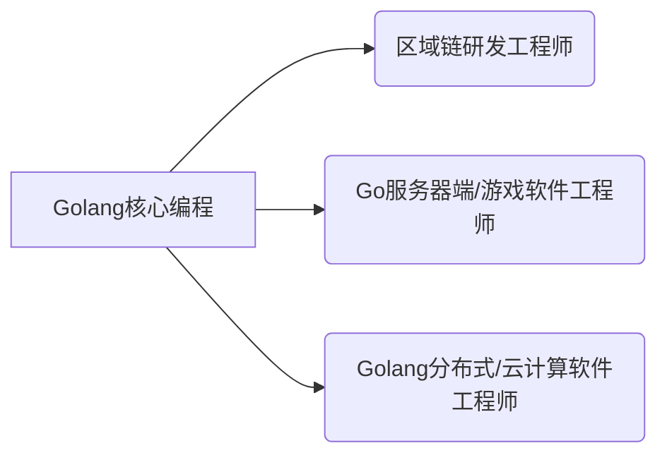
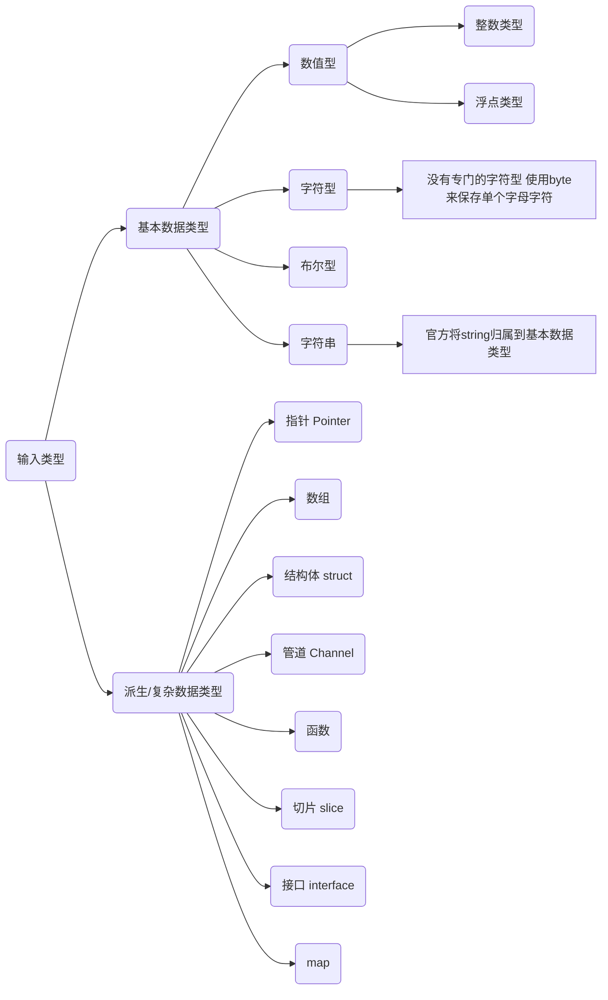

# 第一章 Golang 开山篇


## 1.1 Golang 学习方向

Go语言，我们可以简单的写成 Golang。



## 1.2 Golang 的应用领域

### 1.2.1 区块链的应用开发

区块链技术，简称BT(Blockchain technology)，也被称之为**分布式账本技术**，是一种互联网数据库技术，其特点是去**中心化、公开透明**， 让**每个人均可参与数据库记录**


### 1.2.2 后端服务器应用

##### **美团后台流量支撑程序**

支撑主站后台流量（排序，推荐，搜索等），提供负载均衡，cache，容错，按条件分流，统计运行指标 (qps, latency ）等功能

##### **仙侠道**

产品网址：仙使道官网-心动游戏应用范围：游戏服务端（通讯、逻辑、 数据存储）


### 1.2.3 云计算/云服务后台应用

**盛大云CDN(内容分发网络）**

- 应用范围：CDN的调度系统、分发系统、 监控系统、短域名服务，CDN内部开放平台、运营报表系统以及其他一些小工具等

- 京东消息推送云服务/京东分布式文件系统

- 应用范围：后台所有服务全部用go实现


# 第二章 Golang概述


## 2.1 什么是程序

程序：为了让计算机执行某些操作或解决某个问题而编写的一系列有序指令的集合。

程序是一组计算机能识别和执行的指令，是若干指令或命令的集合，运行于电子计算机上，满足人们某种需求的信息化工具。

它以某些程序设计语言编写，运行于某种目标结构体系上。打个比方，程序就如同以英语（程序设计语言）写作的文章，要让一个懂得英语的人（编译器）同时也会阅读这篇文章的人（结构体系）来阅读、理解、标记这篇文章。一般的，以英语文本为基础的计算机程序要经过编译、链接而成为人难以解读，但可轻易被计算机所解读的数字格式，然后放入运行。


## 2.2 why is Go语言?

**Go语言是区块链最主流的编程语言， 同时也是当前最具发展潜力的语言。**

Go语言是**Google公司创造的语言**，也是Google主推的语言。

国外如Google、Aws、 Cloudflare、 Coreos等，国内如七牛、阿里、小米、京东等都己经开始大规模使用Golang开发其云计算相关产品。


## 2.3 Go语言的诞生

### 2.3.1 Go语言的核心开发团队

**Ken Thompson(肯•汤普森）**^[^^1^^]^：1983年图灵奖（Turing Award）和1998年**美国国家技术奖** (National Medal of Technology）得主。他与Dennis Ritchie是Unix的原创者。Thompson也发明了后来術生出C语言的B程序语言，同时也是C语言的主要发明人。


**Rob Pike(罗布.派克）**^[^^2^^]^：曾是**贝尔实验室**（Bell Labs）的Unix团队，和Plan 9操作系统计划的成员。


他与Thompson共事多年，并共创出广泛使用的UTF-8 字元编码。

Robert Griesemer：曾协助制作Java的HotSpot**编译器**，和Chrome浏览器的JavaScript引擎V8。

### 2.3.2Google为什么要创造Go语言

1. 计算机硬件技术更新频繁，性能提高很快。目前主流的编程语言发展明显落后于硬件，不能合理利用**多核多CPU**的优势提升软件系统性能。

2. 软件系统复杂度越来越高，维护成本越来越高，目前**缺乏一个足够简洁高效**的编程语言。

> 现有的编程语言：
>
> 1. 风格不统一
> 2. 计算能力不够 
> 3. 处理大并发不够好

3. 企业运行维护很多clc++的项目，clc++程序运行速度虽然很快，但是编译速度确很慢，同时还存在**内存泄漏**的一系列的困扰需要解决。

### 2.3.3 Go语言发展简史

- 2007年，谷歌工程师Rob Pike, Ken ThomFson 和Robert Griesemer开始设计一门全新的语言，这是Go语言的最初原型。

- 2009年11月10日，Google将Go语言以开放源代码的方式向全球发布。

- 2015年8月19日，Go1.5版发布，本次更新中移除了”最后残余的C代码”

- 2017年2月17日，Go语言Go1.8版发布。

- 2017年8月24日，Go语言Go1.9版发布。

- 2018年2月16日，Go语言Go1.10版发布。


## 2.4 Go语言特点

Go语言保证了既能到达**静态编译语言**的安全和性能，又达到了**动态语言开发维护的高效率**，使用一个表达式来形容Go语言：**Go =C+ Python**，说明Go语言既有c静态语言程序的运行速度，又能达到Python动态语言的快速开发。

1) 从c语言中继承了很多理;念，包括表达式语法，控制结构，基础数据类型，调用参数传值，指针等等，也保留了和c语言一样的编译执行方式及弱化的指针。

```go
func testPtr(num *int) {
  *num = 20
}
```

2. 引入**包的概,念**，用手组织程序结构，Go语言的**一个文件都要归属于一个包**，而不能单独存在。

```go
package main // 一个go文件需要在一个包

import "fmt"
func sayHello {
  fmt.Println("ok")
}
```

3. 垃圾回收机制，内存自动回收，不需开发人员管理。

4. **天然并发**

   1. 从语言层面支持并发，实现简单。

   2. goroutine，轻量级线程，**可实现大并发处理**，高效利用多核。
   3. 基于cps并发模型(Communicating Sequential Processes )实现。

5. 吸收了管道通信机制，形成Go语言特有的管道channel 通过管道channel，可以实现不同的goroute之间的相互通信。

6. 函数返回多个值

```go
func getSumAnSub(n1 int, n2 int)(int, int) {
  sum := n1 + n2
  sub := n1 - n2
  return sum, sub
}
```

7. 新的创新：比如切片、延时执行defer等


## 2.5 Go语言的开发工具

### 2.5.1 工具介绍

1. visual studio code：Microsoft 产品(VSCode)：一个运行于 Mac os x、 Windows和 Linux 之上的，**默认提供Go语言的语法高亮**，安装Go语言插件，还可以支持智能提示，編译运行等功能。

2) Sublime Text：可以免费使用，默认也支持Go代码语法高亮，只是保存次数达到一定数量之后就会提示是否购买， 点击取消继续用，和正式注册版本没有任何区别 

3) Vim：Vim是从vi发展出来的一个文本编辑器，代码补全、 编译及错误跳转等方便编程的功能特别丰富，在程序员中被广泛使用

4) Emacs：Emacs传说中的神器，她不仅仅是一个编辑器， 因为功能强大，可称它为集成开发环境

5. Eclipse IDE工具，开源免费，并提供GoEclipse插件
6. LiteIDE：LiteIDE是一款专门为Go语言开发的跨平台轻量级集成开发环境（1DE），是国人开发的。
7. JetBrains公司的产品：PhpStrom、 WebStrom 和PyCharm 等IDE工具， 都需要安装Go插件。

### 2.5.2 工具选择

- 如何选择开发工具

  - 我们先选择用visual studio code或者vim文本编辑器本，到大家对Go语言有一定了解后，我们再使用Eclipge等IDE开发工具。

- 这是为什么呢

  1. 更深刻的理解Go语言技术，培养代码感。
  2. 有利于公司面试。

  

## 2.6 Go开发环境的搭建

### 2.6.1 Windows下搭建Go 开发环境

#### 介绍 SDK

- **SDK 的全称(Software Development Kit 软件开发工具包）** 
- SDK是提供给开发人员使用的，其中包含了对应开发语言的工具包。

#### 下载 SDK工具包

1. Go 语言的官网为：golang.org．因为各种原因，可能无法访问。

2. SDK 下载地址：[Golang 中国](https:/www.golangtc.com /dowuloas)
3. 如何选择对应的 sak版本

#### 安装 SDK工具包

将 SDK 工具包解压到你的盘符即可。

### 2.6.2 Linux/MacOS下搭建Go开发环境

用你发行版对应的包管理器安装即可（基本都有go）。

MacOS使用`HomBrew`即可。


## 2.7 Golang 执行流程分析

如果是对源码編译后，再执行，Go的执行流程如下图：


如果我们对源码直接 执行  `go run`  Go的执行流程如下图：


> #### 说明：两种执行流程的方式区别
>
> 1. 如果我们先编译生成了可执行文件，那么我们可以将该可执行文件拷贝到没有go开发环境的机器上，仍然可以运行
>
> 2. 如果我们是直接 go run go源代码，那么如果要在另外一个机器上这么运行，也需要go 开发环境，否则无法执行。
>
> 3. 在编译时，编译器会将程序运行依赖的库文件包含在可执行文件中，所以，可执行文件变大了很多。


## 2.8 Golang编译运行说明

### 2.8.1 什么是编译

1. 有了go源文件，通过编译器将其编译成机器可以识别的二进制码文件。

2. 在该源文件目录下，通过go build 对hello.go 文件进行编译。可以**指定生成的可执行文件名**，在windows下必须是 .exe 后缀。

3. 如果程序没有错误，没有任何提示，会在当前目录下会出现一个可执行文件 (**windows下是.exe Linux下是一个可执行文件**），该文件是二进制码文件，也是可以执行的程序。

4. 如果程序有错误，编译时，会在错误的那行报错。

### 2.8.2 什么是运行

1. 直接运行生成的可执行Go程序，比如hello.exe 
2. 通过运行工具go run 对源代码文件进行运行。


## 2.9 Go 语言快速入门

### Go 程序开发的注意事项

1. Go源文件以"go"为扩展名。

2. Go应用程序的执行入口是main()函数。

3.Go语言严格区分大小写。

4. Go方法由一条条语句构成，每个语句后不需要分号(**Go语言会在每行后自动加分号**)，这也体现出Golang的简洁性。 T

5. Go編译器是一行行进行编译的，因此我们一行就写一条语句，不能把多条语句写在同一个，否则报错

6. Go语言**定义的变量**或者**import的包**如果没有使用到，代码不能編译通过。

7. 大括号都是成对出现的，缺一不可。


## 2.10 Go语言转义字符

- \t ：一个制表位，实现对齐的功能

- \n：换行符

- \\\\：一个\

- \\" ：一个"

- \r：一个回车


## 2.11 注释

#### 2.11.1 介绍：

用于注解说明解释程序的文字就是注释，**注释提高了代码的阅读性**；

注释是一个程序员必须要具有的良好编程习惯。将自己的思想通过注释先整理出来 ，再用代码去体现。

#### 2.11.2 Go语言中的注释类型

Go支持C语言风格的大*/块注释，也支持C+＋风格的//行注释。行注释更通用，块注释主要用于针对**包**的详细说明或者屏蔽**大块的代码**

1. 行注释
   - 基本语法：`// 注释内容`

2. 块注释（多行注释）
   - 基本语法：`/* 注释内容 */`
   - 注意：块注释中不能嵌套块注释

> 注释是帮助程序员理解程序的，计算机不会读取其内容。


## 2.12 规范代码风格

#### 2.12.1 正确的注释和注释风格：

1. Co官方推荐使用行注释来注释整个方法和语句。
2. 带看Go源码

#### 2.12.2 正确的缩进和空白

1. 使用一次tab操作，实现缩进,默认整体向右边移动，时候用shift+tab整体向左移
2. 或者使用 gofmt 来进行格式化[演示]
3. 运算符两边习惯性各加一个空格。比如：2+4*5。


# 第三章 变量


## 3.1 为什么需要变量

一个变量就是一个世界


> **变量是程序的基本组成单位**


## 3.2 变量介绍

### 3.2.1 概念

变量相当于内存中一个数据存储空间的表示，你可以把变量看做是一个房间的门牌号，通过门牌号我们可以我到房间，同样的道理，通过变量名可以访问到变量 （**值**）。

### 3.2.2 变量使用的基本步骤

1) 声明变量（有人也叫：定义变量）
1) 赋值
1) 使用


## 3.3 变量使用细节

1. 变量表示内存中的一个存储区域

2. 该区域有自己的名称（变量名）和类型（数据类型）

3. Golang变量使用的三种方式
   1. 第一种：指定变量类型，声明后若不赋值，使用默认值
   2. 第二种：根据值自行判定变量类型（类型推导）
   3. 第三种：省略var，注意：=左侧的变量不应该是已经声明过的，否则会导致编译错误

4. 多变量声明

在编程中，有时我们需要一次性声明多个变量，Golang也.提供这样的语法。


## 3.3 变量使用注意事项

1. 变量表示内存中的一个存储区域

2. 该区域有自己的名称（变量名）和类型（数据类型）

3. Golang变量使用的三种方式

   1. 第一种：指定变量类型，声明后若不赋值，使用默认值

   2. 第二种：根据值自行判定变量类型（类型推导）

   3. 第三种：省略var,注意：左侧的变量不应该是已经声明过的，否则会导致编译错误

4. 多变量声明
   - 在編程中，有时我们需要工次性声明多个变量，Golang也提供这样的语法

5. 该区域的数据值可以在同一类型范围内不断变化
6. 变量在同一个作用域内不能重名
7. 变量-变量名+值+数据类型，这一点请大家注意。
8. Golang的变量如果没有赋初值，**编译器会使用默认值**，比如 int默认值0string默认值为空串


## 3.4 变量的声明，初始化和赋值

### 3.4.1 声明变量

**基本语法：var 变量名数据类型**

`var a int` 这就是声明了一个变量,变量名是a

`var num1 float32`这也声明了一个变量，表示一个单精度类型的小数，变量名是num1

### 3.4.2 初始化变量

在声明变量的时候，就给值。

`var a int = 45 `这就是初始化变量a

使用細节：如果声明时就直接赋值，可省略数据类型

`var b = 400`

### 3.4.3 给变量赋值

比如你先声明了变量：`var num int`

然后，再给值 `num=780;`这就是给变量赋值.


## 3.5 变量的数据类型

每一种数据都定义了明确的数据类型，在内存中分配了不同大小的内存空间。




### 3.5.1 整数类型

简单的说，就是用于存放整数值的，比如 0,-1,2345 等等。

##### 整数的类型(有符号)

| 类型  | 有无符号 | 占用储存空间 | 表数范围           |
| ----- | -------- | ------------ | ------------------ |
| int8  | 有       | 1            | -128~127           |
| int16 | 有       | 2            | -2^1^^5^~2^1^^5^-1 |
| int32 | 有       | 4            | -2^3^^1^~2^3^^1^-1 |
| int64 | 有       | 8            | -2^6^^3^~2^6^^3^-1 |

##### 整数的类型(无符号)

| 类型   | 有无符号 | 占用储存空间 | 表数范围           |
| ------ | -------- | ------------ | ------------------ |
| uint8  | 无       | 1            | -128~127           |
| uint16 | 无       | 2            | -2^1^^5^~2^1^^5^-1 |
| uint32 | 无       | 4            | -2^3^^1^~2^3^^1^-1 |
| uint64 | 无       | 8            | -2^6^^3^~2^6^^3^-1 |

##### 整数的类型

| 类型 | 有无符号 | 占用储存空间 |
| ---- | -------- | ------------ |
| Int  | 有       | 4/8          |
| uint | 无       | 4/8          |
| rune | 有       | 与int32一样  |
| byte | 无       | 与uint8 等价 |

#### 整数的使用细节

1. Golang各整数类型分：有符号和无符号，int uint 的大小和系统有关。

2. Golang的整型默认声明为 int 型

3. 如何在程序查看某个变量的**字节大小**和**数据类型**

4. Golang程序中整型变量在使用时，遵守保小不保大的原则，即：在保证程序正确运行下，尽量使用占用空间小的数据类型。【如：年龄】

5. **bit:计算机中的最小存储单位。byte:计算机中基本存储单元。**


### 3.5.2 浮点类型

小数类型就是用于存放小数的，比如 1.2 0.23 -1.911

##### 浮点型的分类

| 类型           | 占用储存空间 |
| -------------- | ------------ |
| 单精度 float32 | 4            |
| 双精度 float64 | 8            |

> #### 提示：
>
> 1. 关于浮点数在机器中存放形式的简单说朗,**浮点数=符号位+指数位+尾数位**
>
> 2. 尾数部分可能丢失，造成精度损失。-123.0000901
> 3. 浮点型的存储分为三部分：符号位+指数位+尾数位在存储过程中，精度会有丢失

#### 浮点数使用细节

1. Golang 浮点类型有固定的范围和字段长度，不受具体OS(操作系统)的影
2. Golang 的浮点型默认声明为float64 类型。

3. 浮点型常量有两种表示形式

   - 十进制数形式

     eg. 5.12 .512 (必须有小数点）

   - 科学计数法形式

     eg. 5.1234e2= 5.12*10^2^ 5.12E-2= 5.12/10^-^^2^

4. 通常情况下，应该使用 float64，因为它比float32 更精确。

#### 3.5.3 字符类型

**Golang中没有专门的字符类型**，如果要存储单个字符(字母)，一般使用byte来保存。

**字符串就是一串固定长度的字符连接起来的字符序列**，Go的字符串是由单个字节连接起来的。

也就是说对于传统的字符串是由字符组成的，而**Go的字符串不同**，它是**由字节组成的**。

> #### 注意：
>
> 1. 如果我们保存的字符在 ASCI 表的,比如[0-1,a-Z,A-Z.]直接可以保存到 byte
> 2. 如果我们保存的字符对应码值大于255,这时我们可以考虑使用 int 类型保存
> 3. 如果我们需要安装字符的方式输出，这时我们需要格式化输出，即`fntPintf("%c", varName)`

##### 字符类型开发细节

1. 字符常量是用单引号(“)括起来的单个字符。例如：`var c1 byte ='a' var c2 int = 中" var c3 byte ='9'`。

2. Go中允许使用转义字符`\`来将其后的字符转变为特殊字符型常量。例如：`var c3 char ='\n' //n`表示换行符 Go语言的字符使用UTF-8编码。

3. 在Go中，字符的本质是一个整数，直接输出时，是该字符对应的UTF-8编码的码值。

4. 可以直接给某个变量赋一个数字，然后按格式化输出时%c， 会输出该数字对应的unicode 字符。

5. 字符类型是可以进行运算的，相当于一个整数，因为它都对应有**Unicode码**。

#### 3.5.4 布尔类型

1. 布尔类型也叫bool类型，bool类型数据只允许取值true和false 
2. bool类型占1个字节。
3. boolean 类型适于逻辑运算，一般用于程序流程控制

4. 多用于`if条件语句`或`for循环语句`

#### 3.5.5 字符串数据类型

字符串就是一串固定长度的字符连接起来的字符序列。Go的字符串是由**单个字节**连接起来的。Go语言的字符串的字节使用UTF-8编码标识Unicode文本。

#### 字符串数据注意事项

1. Go语言的字符串的字节使用UTF-8编码标识Unicode文本，这样Golang统一使用 UTF-8编码， 中文乱码问题不会再困扰程序员。

2. 字符串一旦赋值了，字符串就不能修改了：在Go中字符串是不可变的。

3. 字符串的两种表示形式

   1. 双引号，会识别转义字符

   2. 反引号，以字符串的原生形式输出，包括换行和特殊字符，可以实现防业攻击、输出源代码等效果

4. 字符串拼接：当一行字符串太长时，需要使用到多行字符串

#### 基本数据类型的默认值

在go中，数据类型都有一个默认值，当程序员没有赋值时，就会保留默认值，在go中，默认值又叫零值。

| 数据类型 | 默认值 |
| -------- | ------ |
| 整型     | 0      |
| 浮点型   | 0      |
| 字符串   | “”     |
| 布尔类型 | false  |


## 3.6 基本数据类型转换

### 3.6.1 介绍

Golang 和java/c不同，Go 在不同类型的变量之问赋值时需要显式转换。也就是说Golang中数据类型**不能自动转换**。

### 3.6.2 基本语法

表达式`T(v)`将值v转化为类型T

### 2.6.3 细节说明

1. Go中，数据类型的转换可以是从表示范围小->表示范围大，也可以范围大->范围小
2. 被转换的是**变量存储的数据**(即值)，变量本身的数据类型并没有变化！

3. 在转换中，比如将 int64 转成int8，编译时不会报错，只是转换的结果是按溢出处理，和我们希望的结果不一样。


## 3.7 基本数据类型转换为String类型

在程序开发中，我们经常将基本数据类型转成 sting.或者将 string 转成基本数据类型。

### 3.7.1 基本类型转String类型

1. `fmt.Sprintf(%参数”，表达式)`【个人习惯这个，灵活】 
   1. 参数需要和表达式的数据类型相匹配
   2. fmt.Sprintf).会返回转换后的字符串

2. 使用strconv包的函数

###  3.7.2 String类型转基本类型

使用 strconv包的函数

