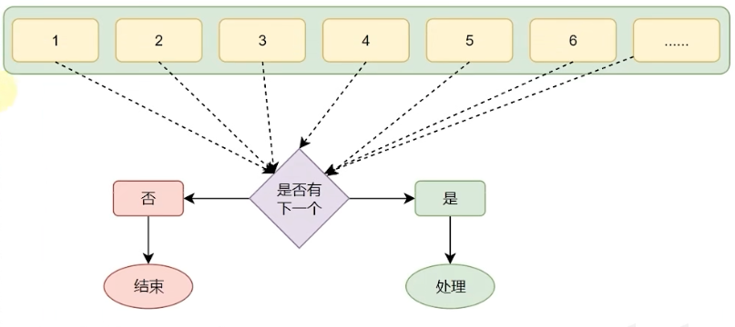

# 第一章 Python概述


## 一、初识Python

### 1. Python的起源

- 1989年，为了打发圣诞节假期，Gudio van Rossum吉多·范罗苏姆决心开发一个新的解释程序(Python雏形)。

- 1991年，第一个Python解释器诞生。

- Python.这个名字，来自龟叔所挚爱的电视剧Monty Python's Flying Circus

### 2. 为什么选择Python

#### 2.1 优雅


> 简单、易学、开发效率高

#### 2.2 适用面广泛

| 人群/岗位         | 用Python做什么                               |
| ----------------- | -------------------------------------------- |
| IT从业者          | 自动化脚本（运维开发、测试开发等）           |
| 普通白领          | 自动化办公                                   |
| 后端开发          | WEB应用程序                                  |
| 科学家            | 基于Python完成数据计算（生物、化学、物理）   |
| 人工智能/机器语言 | 基于Python开发AI程序                         |
| 大数据开发        | 基于Python完成大数据任务开发（Spark、Flink） |
| 学生              | 计算机二级考试                               |


## 二、什么是编程语言

- 语言：进行沟通交流的表达方式。


计算机只认识二进制的0和1，我们需要用编程语言来表达想法，然后通过翻译程序将其翻译为二进制语言，并发送给计算机。计算机会读取指令并且反馈一系列指定操作。

- 编程语言：用于人类和计算机进行交流的一种语言，通过编写编程语言的代码，去指挥计算机工作。

> 编程语言无法直接和计算机沟通，需要翻译工具（解释器或编译器）将代码翻译为二进制，从而实现和计算机的顺畅沟通。
>
> - 为什么不直接将中文翻译成二进制文件？
>   1. 自然语言的表达方式繁多，不利于编译器翻译；编程语言语法“死板”，利于编译器翻译。
>   2. 编译器：固定的翻译模板，固定的编程语言对应的二进制指令也是固定的。


## 三、Python安装

想要使用Python语言编写程序，我们必须下载Python安装包并配置Python3环境。

### 1. Windows

在[Python官网](python.org)下载最新的Python安装包（.exe），双击运行此安装包。


然后`Install Now`，就安装成功了。

### 2. Linux & MacOS

```bash
# Linux
# Debain
sudo apt install python3
# Arch
sudo pacman -S python3
# Red Hat
yum install python3

# MacOS
brew install python3
```

其他linux系统直接使用系统默认的包管理器安装即可。

如果mac用户没有配置`Homebrew`也可以在[官网](python.org)下载安装包（.pkg）即可。 


## 三、第一个Python程序

向世界说你好，应该是全世界，所有程序员入门编程语言时，都会选择的第一个程序。

让我们也延续这一份来自程序员之间的浪漫，学习如何使用Python,向世界说你好。

```bash
$ python3
Python 3.10.10 (main, Feb  8 2023, 05:34:50) [Clang 14.0.0 (clang-1400.0.29.202)] on darwin
Type "help", "copyright", "credits" or "license" for more information.
>>> print("Hello World!")
Hello World!
```

我们在终端（控制台）输入`Python3`然后输入`print("Hello World!")`回撤，终端便会返回`“Hello World!”`字符串。

> 注意：Python所有的符号都为英文符号，如果输入中文符号会报错。

`print()`是一个函数，它的作用是打印输出`()`里的内容。

在Python中，函数主要以`关键字(参数)`的形式存在，每个函数的功能都不同。当我们想要调用某个函数时，直接在文本中写入函数即可。

当我们需要频繁执行某个操作，但是在Python中并没有此功能的函数，我们就可以在当前文本中自定义一个函数[^1 ]，在之后的语句中调用此函数。

> 自定义函数会在后文[Python函数](./05-Python函数.md)讲解，现在了解即可。


## 四、Python解释器

首先，一个基本原理是：**计算机只认识二进制，即：0和1**


计算机不理解Python语言，但是`Python解释器`会将Python语言翻译为二进制语言。


安装Python环境，本质就是在电脑中安装`Python翻译器程序`。在[第一个Python程序](#三、第一个Python程序)中我们在终端输入的`Python3`本质就是调用Python翻译器程序。

我们也可以创建一个为`*.py`的文件 通过`Python3 /some/path/*.py`来编译运行python文件。


## 五、Python开发环境

### 1. 什么是Pycharm

Python程序的开发有许多种方式，一般我们常见的有：

- Pythoni解释器环境内，执行单行代码；
- 使用Python解释器程序，执行Python代码文件；
- **使用第三方IDE(集成开发工具)，如PyCharm软件，开发Python程序**。

PyCharm集成开发工具(IDE),是当下全球Python开发者，使用最频繁的工具软件。

绝大多数的Python程序，都是在PyCharm工具内完成的开发。

### 2. 安装Pycharm

我们先[下载](https://www.jetbrains.com/pycharm/download/)它，并运行安装包。


# 第二章 Python基础语法


## 1. 字面量

字面量：在代码中，被**写下来的**的固定的值称之为字面量。

### 1.1 常用的值类型

Python中常用的有6种值（数据）类型


### 1.2 字符串

字符串(string)：又称文本，是由任意数量的字符如中文、英文、各类符号、数字等组成，所以叫做字符串。

> 字符串通常由一对英文双引号包裹。


## 2. 注释

### 2.1 注释的作用

注释通常用来标记语句作用，以便他人理解代码。

> 注释不会被计算机读取，仅供人阅读、参考。

### 2.2 注释的分类

- 单行注释：以#开头，#右边的所有文字当作说明，而不是真正要执行的程序，起辅助说明作用。

  

  > 注意：#号和注释内容一般建议以一个空格隔开

- 多行注释：以一对三个双引号引起来("""注释内容""")来解释说明一段代码的作用使用方法。


## 3. 变量

变量：在程序运行时，能储存计算结果或能表示值的抽象概念。
简单的说，变量就是在程序运行时，记录数据用的。

变量的格式：变量的名 = 变量的值 eg. age = 18

- age：每一个变量都有自己的名称，称之为：变量名，也就是变量本身。

- =：赋值，表示将等号右侧的值，赋予左侧的变量。

- 变量的值：每一个变量都有自己存储的值（内容)，称之为变量值。


## 4. 数据类型

目前在入门阶段，我们主要接触如下三类数据类型：

| 类型   | 描述             | 说明                       |
| ------ | ---------------- | -------------------------- |
| string | 字符串类型       | 用引号引起来的数据是字符串 |
| int    | 整型（有符号）   | 数字类型，存放整数         |
| float  | 浮点型（有符号） | 数字类型，存放小数         |

### 4.1 验证数据类型

我们可以通过`Type(varName)`的方式查看变量类型。


## 5. 数据类型转换

数据类型之间，在特定的场景下，是可以相互转换的，如字符串转数字、数字转字符串等。

| 语句（函数） | 说明                |
| ------------ | ------------------- |
| int(x)       | 将x转换为一个整数   |
| float(x)     | 将x转换为一个浮点数 |
| str(x)       | 将x转换为字符串     |


## 6. 标识符

### 6.1 什么是标识符

在Py thon程序中，我们可以给很多东西起名字，比如：

- 变量的名字
- 方法的名字
- 类的名字，等等

这些名字，我们把它统一的称之为标识符，用来做内容的标识。

所以，标识符：是用户在编程的时候所使用的一系列名字，用于给变量、类、方法等命名。

### 6.2 标识符命名规则

Python中，标识符命名的规则主要有3类：

- 内容限定
- 大小写敏感

#### 6.2.1 内容限制

标识符命名中，只允许出现：

- 英文
- 中文
- 数字
- 下划线（_)

这四类元素。其余任何内容都不被允许。

> 注意：
>
> 1. 不推荐使用中文
> 2. 数字不可以开头

#### 6.2.2 大小写敏感

`Age`和`age`是两个变量，可以储存不同的值。

#### 6.2.3 不可使用关键字

Python中有一系列单词，称之为关键字；

关键字在Python中都有特定用途；

我们不可以使用它们作为标识符。  

### 6.3 变量的命名规范

- 变量名
- 类名
- 方法名

不同的标识符，有不同的规范。

#### 6.3.1 见名知意

- 明了：尽量做到，看到名字，就知道是什么意思

- 简洁：尽量在确保“明了”的前提下，减少名字的长度

#### 6.3.2 下划线命名

多个单词组合变量名，要使用下划线做分隔。

#### 6.3.3英文字母全小写

命名变量中的英文字母，应全部小写。


## 7. 运算符

### 7.1 算术（数学）运算符

| 运算符 | 描述   | 实例                                                     |
| ------ | ------ | -------------------------------------------------------- |
| +      | 加     | 两个对象相加a+b输出结果30                                |
| -      | 减     | 得到负数或是一个数减去另一个数a-b输出结果-10             |
| *      | 乘     | 两个数相乘或是返回一个被重复若干次的字符串a*b输出结果200 |
| /      | 除     | b/a输出结果2                                             |
| //     | 取整除 | 返回商的整数部分9//2输出结果4,9.0//2.0输出结果4.0        |
| %      | 取余   | 返回除法的余数b%a输出结果0                               |
| **     | 指数   | a*b为10的20次方，输出结果100000000000000000000           |

### 7.2 赋值运算符

| 运算符 | 描述       | 实例                                                      |
| ------ | ---------- | --------------------------------------------------------- |
| =      | 赋值运算符 | 把=号右边的结果赋给左边的变量，如num=1+2*3,结果num的值为7 |

### 7.3 复合赋值运算符

+=、-=、*=、/=、%=、**=、//=

n += 1 即，n=n+1


## 8. 字符串扩展

### 8.1 字符串的三种定义方式

- 字符串在Python中有多种定义形式：
  1. 单引号定义法：name='黑马程序员'
  2. 双引号定义法：name="黑马程序员"
  3. 三引号定义法：name="""黑马程序员"""

> 三引号定义法，和多行注释的写法一样，同样支持换行操作。使用变量接收它，它就是字符串；不使用变量接收它，就可以作为多行注释使用。

### 8.2 字符串拼接

我们可以通过`+`来进行字符串拼接。

### 8.3 字符串格式化

#### 8.3.1 %占位方式

通过`%x`的形式在字符串中引用某个变量，引用的变量写在字符串后面`% varName`。

数据类型占位最常用的有三类

| 格式符号 | 转化                             |
| -------- | -------------------------------- |
| %s       | 将内容转换成字符串，放入占位位置 |
| %d       | 将内容转换成整数，放入占位位置   |
| %f       | 将内容转换成浮点型，放入占位位置 |

##### 8.3.1.1 实际案例

```python
name = 1
age = 2

print("My name is %d, and I'm %d years old."% (name,age))
```

##### 8.3.1.2 格式化的精度控制

我们可以使用辅助符号"m.n"来控制数据的宽度和精度

- 控制宽度，要求是数字**（很少使用）**，设置的宽度小于数字自身，不生效
- 控制小数点精度，要求是数字，会进行小数的四舍五入

#### 8.3.2 {varName}占位方式

通过`f“Hello {World}”`的方式引用World变量。


## 9. 表达式的格式化

表达式：一条具有明确执行结果的**代码语句**。

 无需用变量储存值，可以直接调用一个或多个表达式。


## 10. 用户数据输入

通过`input()`获取用户输入的值。

`print()`函数是将内容输出到屏幕上，而`input()`函数是将键盘输入的数据储存起来。

```python
# 方式一
print("What's your name?")
name = input()

# 方式二
name = input("What's your name?")
```

> 注意：无论用户输入的是什么类型的数据，都会以字符串的形式存储在变量中。


# 第三章 Python判断语句


进行逻辑判断，是生活中常见的行为。同样，在程序中，进行逻辑判断也是最为基础的功能。


## 1. 布尔类型和比较运算符

### 1.1 布尔类型的定义

布尔类型的字面量：

- True 表示真（肯定）
- False 表示假（否定）

可以使用比较运算符进行比较运算得到布尔类型的结果。

### 1.2 比较运算符

数学运算中的比较运算符，用法一致。

表达式：`操作数1 比较运算符 操作数2 = true/false`


## 2. if语句

### 2.1 if语句的基本格式

```python
if 逻辑表达式:
  语句 # 条件成立则运行此语句
```

#### 注意


### 2.2 if else语句

```python
if 表达式:
  statement1 # 表达式为true则执行此语句
else:
  statement2 # 表达式不为true则执行此语句
```

#### 注意


### 2.3 if elif else 语句

```python
if 表达式1:
  statement1 # 表达式1为true则执行此语句
elif 表达式2:
  statement2 # 表达式2为true则执行此语句
elif 表达式3:
  statement3 # 表达式3为true则执行此语句
else:
  statement4 # 表达式x不为true则执行此语句
```

#### 注意


## 3. 判断语句的嵌套


许多逻辑的判断，是嵌套的，多层次的。

对于这种需求，我们可以：自由组合if elif else中完成特定需求的要求。

> 通过缩进来表达if语句的嵌套和所属关系。


# 第四章 Python循环语句


循环普遍存在于日常生活中，同样，在程序中，循环功能也是至关重要的基础功能。


## 1. while语句

### 1.1 while循环的基础语法

```python
while 条件:
  Statement1 # 条件成立，则执行此语句
```

如果条件成立则执行语句，直到条件不成立为止。

#### 案例

1. 我们制作一个自动攻击的AI：

```python
int AIBlood = 100
while AIBlood > 0:
  printf("血量-1")
  AIBlood -= 1
print("He's died")
```

每次执行循环体时`AIBlood`变量都会-1，直到血量为0时，终止循环。输出`AI死亡`。

> 一定要在循环中对循环数进行操作，来控制循环次数。如果不处理循环变量的值，此循环则会一直循环，即进入死循环。

2. 我们求1-100的和

```python
int num = 1
int recode = 0

while num <= 100:
  recode += num
  num += 1
print(recode)
```

### 1.2 while嵌套循环

```Python
while 条件1:
  条件1满足时，做的事情1 
	条件1满足时，做的事情2 
	条件1满足时，做的事情3
	...（省略）...
	while 条件2：
		条件2满足时，做的事情1 
    条件2满足时，做的事情2 
    条件2满足时，做的事情3
		...（省略）...
```

#### 案例

```python
i = 1
while i <= 100:
  print("今天是第{i}天，准备表白……")
  j = 1
  while j <= 10:
    print("送给小美第{i}朵玫瑰花")
    j += 1
  print("小美，我喜欢你")
  i += 1
print("坚持到第{i-1}天，表白成功")
```


## 2. for循环

### 2.1 for循环的基础语法

#### 2.1.1 基础语法

除了while循环语句外，Python同样提供了for循环语句。

两者能完成的功能基本差不多，但仍有一些区别：

- while循环的循环条件是自定义的，自行控制循环条件
- for循环是一种〞轮询〞机制，是对一批内容进行〞逐个处理"
- 

程序中的for循环：

```python
for 临时变量 in 待处理数据集:
  循环满足条件时执行的代码
```

> 同while循环不同，for循环是无法定义循环条件的。只能从被处理的数据集中，依次取出内容进行处理。
>
> 所以，理论上讲，Python的for循环无法构建无限循环（被处理的数据集不可能无限大）

#### 2.1.2 range语句

1. **语法1:**

`range(num)`

获取一个从0开始，到num结束的数字序列（不含num本身）

eg. range(5)取得的数据是：[0, 1, 2, 3, 4]

2. **语法2:**

`range(num1, num2)`

获得一个从num1开始，到num2结束的数字序列（不含num2本身） 

eg. range(5， 10)取得的数据是：[5, 6, 7, 8, 9]

3. **语法3:**

`range(num1, num2, step)`

获得一个从num1开始，到num2结束的数子序列（不含num2本身） 

数字之间的步长，以step为准（step默认为1）

eg. range(5, 10, 2)取得的数据是：[5, 7, 9]

#### 2.1.3 变量作用域

变量只在初始化时的作用域中起作用。

### 2.2 for循环的嵌套

```Python
for 临时变量 in 待处理数据集（序列）:
  循环满足条件应做的事情1
  循环满足条件应做的事情2
  循环满足条件应做的事情N
  ...
  for 临时变量 in 待处理数据集(序列）:
    循环满足条件应做的事情1 
    循环满足条件应做的事情2 
    循环满足条件应做的事情N
```

#### 案例

**输出九九乘法表：**

```python
for i in range(1, 10):
  for j in range(1, i + 1):
    print(f"{j} * {i} = {j*i}\t", end=' ')
  print()
```


## 3. break 和 continue

在这个重复的过程中，会出现一些其它情况让我们不得不：

- 暂时跳过某次循环，直接进行下一次

- 提前退出循环，不在继续

对于这种场景，Python提供continue和break关键字用以对循环进行**临时跳过**和**直接结束**。

### 3.1 continue

continue关键字用于：**中断本次**循环，直接**进入下一次**循环 

continue可以用于：for循环、while循环

> ```python
> for i in range(1, 100):
> 	语句1
> 	continue
> 	语句2
> ```
>
> - 在循环内，遇到continue就结束当次循环，进行下一次；
> - 所以，语句2是不会执行的。

### 3.2 break

break关键字用于：直接结束循环

break可以用于： for循环和while循环，效果一致

> ```python
> for i in range(1, 100):
> 语句1
> break
> 语句2
> 语句三
> ```
>
> - 在循环内，遇到break就结束循环了；
>
> - 所以，执行了语句1后，直接执行语句3了。


# 第五章 Python函数


## 1. 函数介绍

### 函数初体验

函数：是**组织好的，可重复使用的**，用来实现特定功能的**代码段**。

`len()`是一个Python内置的函数，用来判断字符串的长度，即：

```python
str = "Hello World"
print(len(str))
```

如果我们不用内置的`len()`函数，去完成字符串长度计算：

```python
str = "Hello World"
recode  = 0

for i in str:
  recode += 1
print(recode)
```

可见，函数对我们的开发效率起着至关重要的作用。


## 2. 函数的定义

```python
# 函数的定义
def 函数名(传入参数):
  函数体
  return 返回值

# 函数的调用
函数名(参数)
```

> #### **注意：**
>
> 1. 参数如不需要，可以省略（后续章节讲解） 
>
> 2. 返回值如不需要，可以省略（后续章节讲解）
>
> 3. 函数必须先定义后使用

### 案例

定义一个函数，函数名任意，要求调用函数后可以输出如下欢迎语：

请出示您的健康码以及72小时核酸证明！

```python
def Hello():
  print("请出示您的健康码以及72小时核酸证明！")

Hello()
```


## 3. 函数的参数

传入参数的功能是：在函数进行计算的时候，接受外部（调用时）提供的数据。

我们写写一个`1+2的函数`

```python
def add():
  result = 1 + 2
  print(f"1+2的结果为:{result}")
  
add()
```

函数的功能非常局限，只能计算1+2。

有没有可能实现：每一次使用函数，去计算用户指定的2个数字，而非每次都是1+2呢？

```python
def add(x, y):
  result = x + y
  print(f"{x}+{y}的结果为:{result}")

add(2, 5)
```

- 函数定义中，提供的x和y，称之为：形式参数（形参），表示函数声明将要使用2个参数 
  - **参数之间使用逗号进行分隔**

- 函数调用中，提供的5和6，称之为：实际参数（实参），表示函数执行时真正使用的参数值
  - **传入的时候，按照顺序传入数据，使用逗号分隔**

### 案例

定义一个函数，名称任意，并接受一个参数传入（数字类型，表示体温） 

在函数内进行体温判断（正常范围：小于等于37.5度），并输出如下内容：

```python
def temperature(x):
  if x <= 37.5:
    print("正常")
  else:
    print("异常")
    
temperature(int(input("Your temperature:")))
```


## 4. 函数的返回值

### 4.1 函数返回值的定义

##### 4.1.1 什么是返回值

所谓“返回值〞，就是程序中函数完成事情后，最后给调用者的结果。

###### 案例

```python
def add(x, y):
  result = x + y
  return result

num = add(1, 2)
```

#### 4.2 None类型

如果函数没有使用return语句返回数据，其实这个函数也有返回值。

Python中有一个特殊的字面量：None，其类型是：<class "NoneType“> 无返回值的函数，实际上就是返回了：None这个字面量

```python
def say_hello():
  print("Hello...")
	# return None
  
result = say_hello()
print(result) # None
print(type(result)) # NoneType
```

#### None类型的应用场景

None作为一个特殊的字面量，用于表示：空、无意义，其有非常多的应用场景。

- 用在函数无返回值上

- 用在 if 判断上

  - 在 if 判断中，None等同于False
  - 一般用于在函数中主动返回None，配合 if 判断做相关处理

  ```python
  def check_age(age):
    if age > 18:
      return "SUCCESS"
    else:
    	return None
  
  result = check_age(17)
  if not result:
    print("未成年，禁止进入")
  ```


> ## 函数的说明文档
>
> 函数是纯代码语言，想要理解其含义，就需要一行行的去阅读理解代码，效率比较低。
>
> 我们可以给函数添加说明文档，辅助理解函数的作用。
>
> 语法如下：
>
> ```python
> def func(x,y):
> """
> 函数说明
> :param x: 行参x的说明
> :param y: 行参y的说明
> :return: 返回值的说明
> """
> 函数体
> return 返回值
> ```
>
> 通过多行注释的形式，对函数进行说明解释。
>
> > **注意：**内容应写在函数体之前


## 5. 函数的嵌套调用

所谓函数嵌套调用指的是一个函数里面又调用了另外一个函数。

```python
def func_a():
  print("---2---")
  
def func_b():
	print("---1---")
  def func_a()
  print("---3---")
  
func_b()
```

如果函数A中，调用了另外一个函数B，那么先把函数B中的任务都执行完毕之后才会回到上次函数A热行解位。


## 6. 变量的作用域

变量作用域指的是变量的作用范围（变量在哪里可用，在哪里不可用） 

主要分为两类：局部变量、全局变量

- 局部变量：定义在函数体内部的变量，即只在函数体内部生效。

局部变量的作用：在函数体内部，临时保存数据，即当函数调用完成后，则销毁局部变量。

- 所谓全局变量，指的是在函数体内、外都能生效的变量。

### global关键字

使用 global关键字可以在函数内部声明变量为全局变量。

```python
num = 100

def func_a():
  global num
  num = 200
  print(num)
  
printf(num)
func_a()
```


## 综合案例——ATM案例

```python
name = input("姓名：")
money = 5000000
judge = 0

def query_balance():
    """
    查看余额函数
    :return: 余额
    """
    print("----------------查询余额----------------")
    print(f"{name}，你好，您的余额为{money}元")
    return money

def deposit_money(a):
    """
    存钱函数
    :param a: 存入钱款
    """
    print("------------------存款------------------")
    global money
    money += a
    print(f"{name}，您好，您存款{a}元成功")
    print(f"{name}，你好，您的余额为{money}元")
   
def without_money(b):
    """
    取钱函数
    :param b: 取出钱款
    """
    print("------------------取款------------------")
    global money
    money -= b
    print(f"{name}，您好，您取款{b}元成功")
    print(f"{name}，你好，您的余额为{money}元")
    
def main_menu():
    """
    主菜单函数
    """
    print("-----------------主菜单--------------------")
    print(f"{name}，你好，欢迎来到银行ATM，请选择操作:")
    print("查询余额\t[输入1]")
    print("存款\t\t[输入2]")
    print("取款\t\t[输入3]")
    print("退出\t\t[输入4]")
    global judge
    judge = int(input("请输入您的操作: "))


while True:
    main_menu()
    if judge == 1:
        query_balance()
    elif judge == 2:
        deposit_money(int(input("你想存入的额度为(元): ")))
    elif judge == 3:
        deposit_money(int(input("你想取出的额度为(元): ")))
    elif judge == 4:
        print("退出成功，祝您生活愉快")
        break 
    else:
        print("您的操作无效，请重新尝试。")
```


# 第六章 Python 数据容器


## 1. 数据容器的入门

### 1.1 初始数据容器

变量是最基本的数据，但是如果我们想要100个数据，就需要创建100个变量，高级但低效。

```python
name1 ='王丽红'
name2 ='周杰轮' 
name3 ='林俊节'
name4 ='张学油' 
name5 ='刘德滑'
```

我们可以用一个变量储存多个值，这样的变量就是数据容器。

```python
nameList 二 ['王丽红'，'周杰轮'，'林俊节'，'张学油'，'刘德滑'] print(nameList)
```

这样储存数据优雅切高效。

这就是数据容器，一个容器可以容纳多份数据。

### 1.2数据容器

Python中的数据容器：

一种**可以容纳多份数据**的数据类型，容纳的每**一份数据称之为1个元素**。


每一个元素，可以是任意类型的数据，如字符串、数字、布尔等。

数据容器根据特点的不同，如：

- 是否支持重复元素

- 是否可以修改

- 是否有序，等

分为5类，分别是：

**列表（list）**、**元组（tuple）**、**字符串（str）**、**集合(set）**、**字典 (dict)**


## 2. 数据容器：list(列表）

### 2.1 列表的定义

```python
#字面量
[元素1，元素2，元素3，元素4，...]

#定义变量
变量名称=[元素1，元素2，元素3，元素4，...]

# 定义空列表
变量名称=[]
变量名称 = 1ist()
```

列表内的**每一个数据，称之为元素**

- 以`[]`作为标识
- 列表内每一个元素之间用，逗号隔开

> **注意：**列表可以一次存储多个数据，且可以为不同的数据类型，支持嵌套。

### 2.2 列表的下标索引

#### 2.2.1 列表的下标(索引)

我们可以通过下标索引来取出列表中特定位置的数据。


我们可以通过`listName[x]`的方式来调用列表中的单个数据（索引是从0开始的）。


#### 2.2.1 列表的下标(索引) - 反向

也可以反向索引，也就是从后向前：从-1开始，依次递（-1、-2、-3...）


`listName[-x]`即，从后向前调用(反向索引是从-1开始的)。

#### 2.2.3 嵌套列表的下标(索引)

如果列表是嵌套的列表，同样支持下标索引


`listName[x][y]`即，调用索引为x的列表中索引为y的元素。

### 2.3 列表的常用操作

列表除了可以：

- 定义

- 使用下标索引获取值

以外，列表也提供了一系列功能：

- 插入元素

- 删除元素

- 清空列表

- 修改元素

- 统计元素个数

等等功能，这些功能我们都称之为：**列表的方法**

#### 2.3.1 方法的概念

在Python中，如果将函数定义为class（类）的成员，那么函数会称之为：方法。

方法和函数功能一样，有传入参数，有返回值，只是方法的使用格式不同：

- 函数的使用：`num = add (1, 2)`

- 方法的使用：`num = student.add(1, 2)`

#### 2.3.2 index方法

查找某元素的下标

- 功能：查找指定元素在列表的下标，如果找不到，报错ValueError

- 语法：列表.index(元素）

- > index就是列表对象（变量）内置的方法（函数）

#### 2.3.3 修改元素

- 修改特定位直（索引的元素值)：

  - 语法：列表[下标]=值

  - 可以使用如上语法，直接对指定下标（正向、反向下标均可）的值进行：重新赋值（修改）

- 插入元素

  - 在指定的下标位置，插入指定的元素
  - 语法：列表.insert(下标，元素）

- 追加元素

  - 语法1：列表.append(元素），将指定元素，追加到列表的尾部
  - 语法2：列表.extend(其它数据容器)，将其它数据容器的内容取出，依次追加到列表尾部

#### 2.3.4 删除元素

- 语法1：del 列表[下标]
- 语法2：列表.pop(下标)
- 删除某元素在列表中的第一个匹配项
  - 语法：列表.remove(元素)
- 清空列表内容，语法：列表.clear()


## 3. list（列表）的遍历

既然数据容器可以存储多个元素，那么，就会有需求从容器内依次取出元素进行操作。

将容器内的元素依次取出进行处理的行为，称之为：遍历、迭代。

### 3.1 while循环遍历列表

```python
index = 0
myList = [1, 2, 3, 4]
while index < len(myList):
  元素 = 列表[index]
  对元素进行处理
  index += 1
```

### 3.2 for循环遍历列表

```python
myList = [1, 2, 3, 4]
for element in myList:
  元素 = 列表[element]
  对元素进行处理
```

> while循环和for循环，都是循环语句，但细节不同：
>
> - 在循环控制上：
>   - while循环**可以自定循环条件**，并自行控制
>   - for循环**不可以自定循环条件**，只可以一个个从容器内取出数据
>
> - 在无限循环上：
>
>   - while循环**可以**通过条件控制做到无限循环
>
>   - For循环理论上**不可以**，因为被遍厉的容器蓉量不是无限的
>
> - 在使用场景上：
>
>   - whle循环适用于任何想要循环的场景
>
>   - for循环适用于，遍历数据容器的场景或简单的固定次数循环场景


## 4. 数据容器：tuple（元组）

列表是**可以修改**的，如果想要传递信息，**不被篡改**，列表就不合适了。

元组同列表一样，都是可以封装多个、不同类型的元素在内。

最大的不同点在于：**元素一旦定义，就不可以修改。**

### 4.1 元组的定义格式

元组定义：定义元组使用小括号，且使用逗号隔开各个数据，数据可以是不同的数据类型。

```python
变量名称 = (元素，元素，...，元素）
```

> #### **注意：**
>
> 如果元组中只有一个元素，需要在元素后加一个`，`，否则其类型就是当前元素的类型。
>
> 如果在元组中嵌套了一个列表，那么这个列表是可以修改的。

### 4.2 元组的特点

经过上述对元组的学习，可以总结出列表有如下特点：

- 可以容纳多个数据

- 可以容纳不同类型的数据（混装）

- 数据是有序存储的（下标索引）

- 允许重复数据存在

- **不可以修改**（增加或删除元素等）

- 支持for循环


多数特性和list一致，不同点在于不可修改的特性。

### 4.3 元组的常见操作

- index()    查找某个数据，如果数据存在返回对应的下标，否则报错
- count()    统计某个数据在当前元组出现的次数
- len(元组)  统计元组内的元素个数

## 5. 数据容器：str（字符串）

字符串是字符的容器，一个字符串可以存放任意数量的字符。

- 字符串的替换

  - 语法：字符串.replace(字符串1，字符串2） 

  - 功能：将字符串内的全部： 字符串1 替换为序符串2 

  - 注意：不是修改字符串本身，而是得到了一个新字符串哦

- 字符串的分割

  - 语法：字符串.split(分隔符字符串）

  - 功能：按照指定的分隔符字符串，将字符串划分为多个字符串，并存入列表对象中

  - 注意：**字符串本身不变，而是得到了一个列表对象**

- 字符串的规整操作

  - 去前后空格 

    - 语法：字符串.strip()

  - 去前后指定字符串 

    - 语法：字符串.strip(字符串）
    - 注意：传入的字符串会分割为字符，然后取出所有相同的字符。

    

## 6. 数据容器（序列）的切片

### 6.1 序列

序列是指：内容连续、有序，可使用下标索引的一类数据容器。

**列表、元组、字符串，均可以可以视序列。**


### 6.2 切片

序列支持切片，即：列表、元组、字符串，均支持进行切片操作；

切片：从一个序列中，取出一个子序列。

语法：序列[起始下标:结束下标:步长]


## 7. 数据容器：set（集合）

通过特性来分析：

- 列表可修改、支持重复元素且有序
- 元组、字符串不可修改、支持重复元素且有序

```python
# 定义集合字面量
my_set = {"H", "e", "l", "l", "o"}

# 定义空集合
my_set = ()
my_set = dict()
```

### 7.1 集合常用操作

首先，因为集合是无序的，所以集合**不支持：下标索引访问**

但是集合和列表一样，是允许修改的，所以我们来看看集合的修改方法。

- 添加新元素
  - 语法：集合.add(元素)。将指定元素，添加到集合内。
  - 结果：本身被修改，添加了新元素。
- 删除元素
  - 语法：集合.remove(元素)。将指定元素，从集合内移除。
  - 结果：集合本身被修改，移除了元素
- 取出两个集合的差集
  - 语法：集合1.difference(集合2），功能：取出集合1和集合2的差集（集合1有而集合2没有的）
  - 结果：得到一个新集合，集合1和集合2不变
- 2个集合合并
  - 语法：集合1.unior(集合2）
  - 功能：将集合1和集合2组合成新集合结果：得到新集合，集合1和集合2不变
  - 结果：得到新集合，集合1和集合2不变

经过上述对集合的学习，可以总结出集合有如下特点：

- 可以容纳多个数据

- 可以容纳不同类型的数据（混装）

- **数据是无序存储的（不支持下标索引）**
- **不允许重复数据存在**

- 可以修改（增加或删除元素等）

- 支持for循环


## 8. 数据容器：dict(字典、映射）

### 8.1 字典的定义


字典的定义，同样使用0，不过存储的元素是一个个的：健值对，如下语法：

```python
# 定义字典字面量
{key: value, key: value, ... , key: value}

# 定义空字典
my_dict = {}
my_dict = dict()
```

### 8.2 字典的基本操作

- 新增元素

  - 语法：字典(Keyl=Value，结果：字典被修改，新增了元素。

- 更新元素

  - 语法：字典[Keyl= Value，结果：字典被修改，元素被更新。
  - 注意：**字典Key不可以重复，所以对已存在的Key执行上述操作，就是更新Value值**。

- 获取全部的key

  - 语法：字典.keys()，结果：得到字典中的全部Key。

  ```python
  my_dict = {key1: value1, key2: value2, key3: value3}
  my_key = my_dict.keys()
  ```

  

## 9. 数据容器的通用操作

### 9.1 数据特性总结

数据容器可以从以下视角进行简单的分类：

- 是否支持下标索引

  - **支持：列表、元组、字符串 - 序列类型**
  - **不支持：集合、字典- 非序列类型**

- 是否支持重复元素：

  - **支持：列表、元组、字符串- 序列类型**
  - **不支持：集合、字典- 非序列类型**

- 是否可以修改

  - **支持：列表、集合、字典**

  - **不支持：元组、字符串**


1. 基于各类数据容器的特点，它们的应用场景如下：

- 列表：一批数据，可修改、可重复的存储场景

- 元组：一批数据，不可修改、可重复的存储场：

- 字符串：一串字符串的存储场景

- 集合：一批数据，去重存储场景

- 字典：一批数据，可用Key检索Value的存储场景

### 9.2 数据容器的通用操作

sorted() –> 取反

 


# 第七章 Python函数进阶


## 1. 函数多返回值

```python
def return_num():
  return 1
	return 2

result = return_num()
print(result) # 1
```

`return_num函数`的返回值是1，因为只执行了第一个return，return可以退出当前函数， 导致return下方的代码不执行。

如果我们想要接收一个函数的多个返回值：

- 按照返回值的顺序，写对应顺序的多个变量接收即可
- 变量之间用逗号隔开
- 支持不同类型的数据return


## 2. 函数多种传参方式

**使用方式**上的不同，函数有4中常见参数使用方式：

- **位置参数**

- **关键字参数**

- **缺省参数**

- **不定长参数**

### 2.1 位置参数

**位置参数**：调用函数时根据函数定义的**参数位置来传递参数**。

```python
def user_info(name, age, gender):
	print(f"您的名字是{name}，年龄是{age}，性别是 {gender}"）
        
user_info('Hogg', 20, '男')
```

> #### **注意**：
>
> 传递的参数和定义的参数的顺序及个数必须一致

### 2.2 关键字参数

关從字参数：函数调用时通过 1健-量”形式传递参数。

作用：可以让函数更加清晰、容易使用，同时也清除了参数的顺序需求．

```python
def user_info (name, age, gender):
  print(f"您的名字是：{name}，年龄是：{age}，性别是：{gender}")

# 关键字传参
user_info (name="小明"，age=20, gender="男”）
# 可以不按照固定顺序
user_info (age=20, gender="男"，name=”小明"）
# 可以和位置参数混用，位置参数必须在前，且匹配参数顺序 
user_info("小明"，age=20, gender="男"）
```

> #### **注意**：
>
> 函数调用时，如果有位置参数时，位置参数必须在关键字参数的前面，但关键字参数之间不存在先后顺序

### 2.3 缺省参数

缺省参数：缺省参数也叫默认参数，用于定义函数，为参数提供默认值，调用函数时可不传该默认参数的值（注意：所有位置参数必须出现在默认参数前，包括函数定义和调用）.

作用：当调用函数时没有传递参数，就会使用默认是用缺省参数对应的值。

```python
def user_info(name, age, gender='男"):
	print(f'您的名字是{name)，年龄是{age}，性别是{gender}"）

user_ info('ToM", 20)
user_info( "Rose', 18，‘女"）
```

> #### **注意**：
>
> 函数调用时，如果为缺省参数传值则修改默认参数值，否则使用这个默认值。

### 2.4 不定长参数

**不定长参数**：不定长参数也可变参数。用于不确定调用的时候会传递多少个参数（不传参也可以）的场景.

**作用**：当调用函数时不确定参数个数时，可以使用不定长参数

**不定长参数的类型：**

1. **位置传递**

2. **关键字传递**

#### 2.4.1 位置传递

```python
def user_info(*args):
  print (args)

# ('TOM'，)
user_info('TOM'） # ( TOM',18）
# ('TOM', 18)
user_info('TOM'， 18)
```

> #### **注意**：
>
> 传进的**所有参数**都会被**args变量收集**，它会根据传进参数的位置合并为- 元组(tuple)，**args是元组类型**，这就是**位置传递**。

#### 2.4.2 关键字传递

```python
def user_info(**wargs):
  print(kwargs)

#{'name'： 'TOM'，'age'： 18, 'id:110} 
user_info (name='ToM', age=18, id=110)
```

> #### **注意：**
>
> 参数是“键-值”形式的形式的情况下，所有的“键-值”都会被kvargs按受，同时会根据“键-值”组成字典


## 3. 匿名函数

### 3.1 函数作为参数传递

在前面的函数学习中，我们一直使用的函数，都是接受数据作为参数传入：

- 数字

- 字符串

- 字典、列表、元组等

其实，我们学习的函数本身，也可以作为参数传入另一个函数内。

```python
def test_func(computep):
  result= compute(1, 2) print (result)

def compute(x, y):
  return x +y

test_func (compute) ＃ 结果：3
```

**函数compute，作为参数，传入了test_func函数中使用。**

- test func需要一个函数作为参数传入，这个函数需要接收2个数字进行计算，计算逻辑由这个被传入函数决定 
- compute函数接收2个数字对其进行计算，compute函数作为参数，传递给了test func函数使用
- 最终，在test func函数内部，由传入的compute函数，完成了对数字的计算操作

所以，这是一种，**计算逻辑的传递，而非数据的传递**。

就像上述代码那样，不仅仅是相加，相见、相除、等**任何逻辑都可以自行定义并作为函数传入**。

### 3.2 lambda匿名函数

函数的定义中

- def关键字，可以定义**带有名称**的函数

- lambda关键字，可以**定义匿名**函数（无名称） 

有名称的函数，可以基于名称**重复使用**。

无名称的匿名函数，只可**临时使用一次**。


# 第八章 Python 文件操作


## 1. 文件的编码

思考：计算机只能识别：0和1，那么我们丰富的文本文件是如何被计算机识别，并存储在硬盘中呢？

答案：使用编码技术（密码本） 将内容翻译成0和1存入。

编码技术即：翻译的规则，记录了如何将内容翻译成二进制，以及如何将二进制翻译回可识别内容。


计算机中有许多可用编码：

- UTF-8

- GBK

- Big5…

不同的编码，将内容翻译成二进制也是不同的。

编码有许多，所以要使用正确的编码，才能对文件进行正确的读写操作呢。


如上，如果你给喜欢的女孩发送文件，使用编码A进行编码（内容转二进制）。

女孩使用编码B打开文件进行解码（二进制反转回内容），自求多福吧。


## 2. 文件的读取

### 2.1 文件操作概述

#### 2.1.1 什么是文件

内存中存放的数据在计算机关机后就会消失。要长久保存数据，就要使用硬盘、光盘、U 盘等设备。为了便于数据的管理和检索，引入了“**文件**”的概念。

内存中存放的数据在计算机关机后就会消失。要长久保存数据，就要使用硬盘、光盘、U 盘等设备。为了便于数据的管理和检索，引入了“文件”的概念、

**一篇文章、一段视频、一个可执行程序，都可以被保存为一个文件，并赋予一个文件名。**操作系统以文件为单位管理磁盘中的数据。一般来说，文件可分为**文本文件、视频文件、音频文件、图像文件、可执行文件等多种类别**。

#### 2.1.2 文件操作包含的内容

在日常生活中，文件操作主要包括**打开、关闭、读、写**等操作。

#### 2.1.3 文件的操作步骤

息想我们平常对文件的基本操作，大概可以分为三个步骤：

1. 打开文件

2. 读写文件

3. 关闭文件

> #### **注意：**
>
> 可以只打开和关闭文件，不进行任何读写

### 2.2 open()函数

在Python, 使用open函数，可以打开一个己经存在的文件，或者创建一个新文件，语法如下：

```python
open(name,mode,encoding)
```

- name：是要打开的目标文件名的字符串(可以包含文件所在的具体路径)。

- mode：设置打开文件的模式(访问模式)：只读、写入、追加等。
  - r（只读模式）：以只读方式打开文件。文件的指针将会放在文件的开头。这是默认模式。
  - w（写入模式）：打开一个文件只用于写入。如果该文件已存在则打开文件，并从开头开始编辑，**原有内容会被删除**；如果该文件**不存在，创建新文件**。
  - a（追加模式）：
  - 打开一个文件用于追加。如果该文件已存在，**新的内容将会被写入到已有内容之后**；如果该文件**不存在，创建新文件**进行写入。


- encoding：编码格式（推荐使用UTF-8）

> #### **注意：**
>
> 此时的促`open`函数的这件对象，对象是Python中一种特殊的数据类型，拥有属性和方法，可以使用对象.属性或对象.方法对其进行访问，后续面向对象课程会给大家进行详细的介绍。

### 2.3 read()、redlines()方法

###### **read()方法：**

```python
文件对象.read(num)
```

num表示要从文件中读取的数据的长度（单位是字节），如果没有传入num，那么就表示读取文件中所有的数据。

> #### **注意：**
>
> 如果在同一个open中调用多次read()方法，那么下一次read()会从上一次read()的结尾处开始读取（readlines()方法同理）。

###### **readlines()方法**

readlines可以按照行的方式把整个文件中的内容进付一次性读取，并且返回的是一个**列表**，其中每一行的数据为一个元素。

```python
f= open('python.txt')
content = f.readlines()

# ['hello worldin','abcdefgin','aaaln', "bbbin', 'ccc']
print(content)

#关闭文件
f.close()
```

`readline()`方法调用一次读取一行文件。

> 可以用for循环遍历整个列表

### 2.4 close()函数

```python
文件.close()
```

### 2.5 with open语句

```python
with open(name, mode, encoding) as f:
  ...
```

与`open()`不同的是`with open()`会自动关闭文件。


## 3. 文件的写入

```Python
# 打开文件
f = open('python.txt','w')

# 文件写入
f.write('hello world')

# 内容刷新
f.flush()
```

> #### **注意：**
>
> - 直接调用write，内容并未真正写入文件，而是会积攒在程序的内存中，称之为缓冲区
> - 当调用flush的时候，内容会真正写入文件
> - 这样做是避免频繁的操作硬盘，导致效率下降（攒一堆，一次性写磁盘）


## 4. 文件的追加

```python
# 打开文件
f.open('python.txt', 'a')

# 文件写入
f.write('hello world')

# 内容刷新
f.flush()
```

> #### **注意：**
>
> - a模式，文件不存在会创建文件
> - a模式，文件存在会在最后，追加写入文件

 