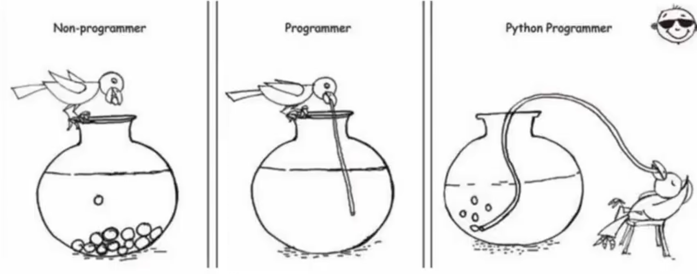

# 你好，Python


## 一、初识Python

### 1. Python的起源

- 1989年，为了打发圣诞节假期，Gudio van Rossum吉多·范罗苏姆决心开发一个新的解释程序(Python雏形)。

- 1991年，第一个Python解释器诞生。

- Python.这个名字，来自龟叔所挚爱的电视剧Monty Python's Flying Circus

### 2. 为什么选择Python

#### 2.1 优雅



> 简单、易学、开发效率高

#### 2.2 适用面广泛

| 人群/岗位         | 用Python做什么                               |
| ----------------- | -------------------------------------------- |
| IT从业者          | 自动化脚本（运维开发、测试开发等）           |
| 普通白领          | 自动化办公                                   |
| 后端开发          | WEB应用程序                                  |
| 科学家            | 基于Python完成数据计算（生物、化学、物理）   |
| 人工智能/机器语言 | 基于Python开发AI程序                         |
| 大数据开发        | 基于Python完成大数据任务开发（Spark、Flink） |
| 学生              | 计算机二级考试                               |


## 二、什么是编程语言

- 语言：进行沟通交流的表达方式。


计算机只认识二进制的0和1，我们需要用编程语言来表达想法，然后通过翻译程序将其翻译为二进制语言，并发送给计算机。计算机会读取指令并且反馈一系列指定操作。

- 编程语言：用于人类和计算机进行交流的一种语言，通过编写编程语言的代码，去指挥计算机工作。

> 编程语言无法直接和计算机沟通，需要翻译工具（解释器或编译器）将代码翻译为二进制，从而实现和计算机的顺畅沟通。
>
> - 为什么不直接将中文翻译成二进制文件？
>   1. 自然语言的表达方式繁多，不利于编译器翻译；编程语言语法“死板”，利于编译器翻译。
>   2. 编译器：固定的翻译模板，固定的编程语言对应的二进制指令也是固定的。


## 三、Python安装

想要使用Python语言编写程序，我们必须下载Python安装包并配置Python3环境。

### 1. Windows

在[Python官网](python.org)下载最新的Python安装包（.exe），双击运行此安装包。

!](./assets/202302171222777.png)

然后`Install Now`，就安装成功了。

### 2. Linux & MacOS

```bash
# Linux
# Debain
sudo apt install python3
# Arch
sudo pacman -S python3
# Red Hat
yum install python3

# MacOS
brew install python3
```

其他linux系统直接使用系统默认的包管理器安装即可。

如果mac用户没有配置`Homebrew`也可以在[官网](python.org)下载安装包（.pkg）即可。 


## 三、第一个Python程序

向世界说你好，应该是全世界，所有程序员入门编程语言时，都会选择的第一个程序。

让我们也延续这一份来自程序员之间的浪漫，学习如何使用Python,向世界说你好。

```bash
$ python3
Python 3.10.10 (main, Feb  8 2023, 05:34:50) [Clang 14.0.0 (clang-1400.0.29.202)] on darwin
Type "help", "copyright", "credits" or "license" for more information.
>>> print("Hello World!")
Hello World!
```

我们在终端（控制台）输入`Python3`然后输入`print("Hello World!")`回撤，终端便会返回`“Hello World!”`字符串。

> 注意：Python所有的符号都为英文符号，如果输入中文符号会报错。

`print()`是一个函数，它的作用是打印输出`()`里的内容。

在Python中，函数主要以`关键字(参数)`的形式存在，每个函数的功能都不同。当我们想要调用某个函数时，直接在文本中写入函数即可。

当我们需要频繁执行某个操作，但是在Python中并没有此功能的函数，我们就可以在当前文本中自定义一个函数[^1 ]，在之后的语句中调用此函数。

> 自定义函数会在后文[Python函数](./05-Python函数.md)讲解，现在了解即可。


## 四、Python解释器

首先，一个基本原理是：**计算机只认识二进制，即：0和1**


计算机不理解Python语言，但是`Python解释器`会将Python语言翻译为二进制语言。


安装Python环境，本质就是在电脑中安装`Python翻译器程序`。在[第一个Python程序](#三、第一个Python程序)中我们在终端输入的`Python3`本质就是调用Python翻译器程序。

我们也可以创建一个为`*.py`的文件 通过`Python3 /some/path/*.py`来编译运行python文件。


## 五、Python开发环境

### 1. 什么是Pycharm

Python程序的开发有许多种方式，一般我们常见的有：

- Pythoni解释器环境内，执行单行代码；
- 使用Python解释器程序，执行Python代码文件；
- **使用第三方IDE(集成开发工具)，如PyCharm软件，开发Python程序**。

PyCharm集成开发工具(IDE),是当下全球Python开发者，使用最频繁的工具软件。

绝大多数的Python程序，都是在PyCharm工具内完成的开发。

### 2. 安装Pycharm

我们先[下载](https://www.jetbrains.com/pycharm/download/)它，并运行安装包。

