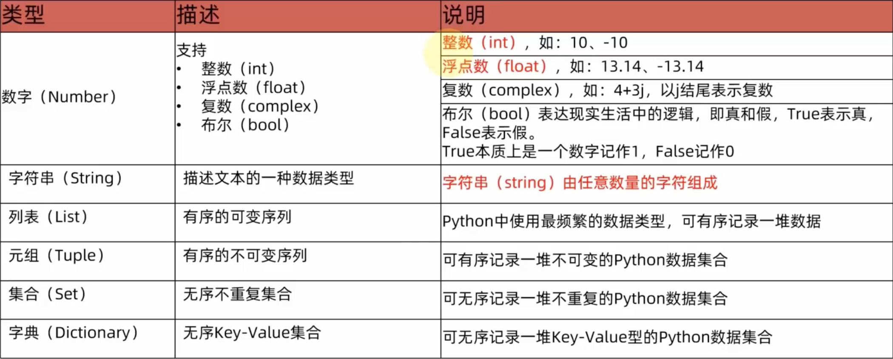
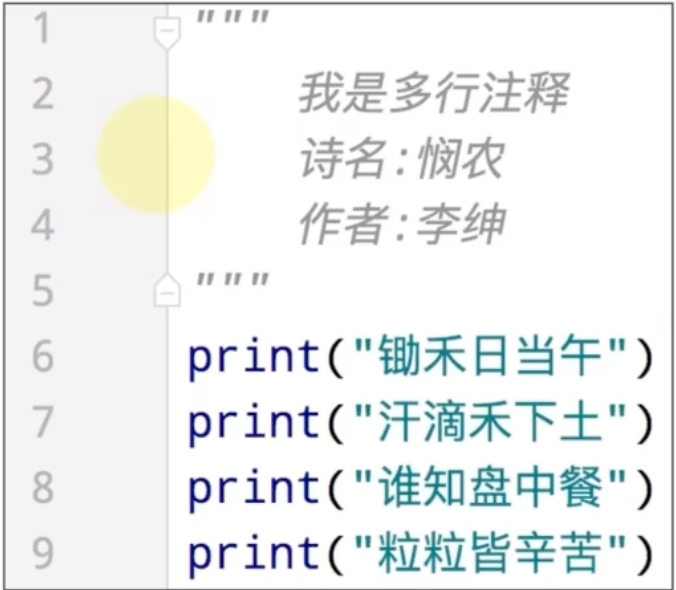

# Python基础语法


## 1. 字面量

字面量：在代码中，被**写下来的**的固定的值称之为字面量。

### 1.1 常用的值类型

Python中常用的有6种值（数据）类型



### 1.2 字符串

字符串(string)：又称文本，是由任意数量的字符如中文、英文、各类符号、数字等组成，所以叫做字符串。

> 字符串通常由一对英文双引号包裹。


## 2. 注释

### 2.1 注释的作用

注释通常用来标记语句作用，以便他人理解代码。

> 注释不会被计算机读取，仅供人阅读、参考。

### 2.2 注释的分类

- 单行注释：以#开头，#右边的所有文字当作说明，而不是真正要执行的程序，起辅助说明作用。

  

  > 注意：#号和注释内容一般建议以一个空格隔开

- 多行注释：以一对三个双引号引起来("""注释内容""")来解释说明一段代码的作用使用方法。




## 3. 变量

变量：在程序运行时，能储存计算结果或能表示值的抽象概念。
简单的说，变量就是在程序运行时，记录数据用的。

变量的格式：变量的名 = 变量的值 eg. age = 18

- age：每一个变量都有自己的名称，称之为：变量名，也就是变量本身。

- =：赋值，表示将等号右侧的值，赋予左侧的变量。

- 变量的值：每一个变量都有自己存储的值（内容)，称之为变量值。


## 4. 数据类型

目前在入门阶段，我们主要接触如下三类数据类型：

| 类型   | 描述             | 说明                       |
| ------ | ---------------- | -------------------------- |
| string | 字符串类型       | 用引号引起来的数据是字符串 |
| int    | 整型（有符号）   | 数字类型，存放整数         |
| float  | 浮点型（有符号） | 数字类型，存放小数         |

### 4.1 验证数据类型

我们可以通过`Type(varName)`的方式查看变量类型。


## 5. 数据类型转换

数据类型之间，在特定的场景下，是可以相互转换的，如字符串转数字、数字转字符串等。

| 语句（函数） | 说明                |
| ------------ | ------------------- |
| int(x)       | 将x转换为一个整数   |
| float(x)     | 将x转换为一个浮点数 |
| str(x)       | 将x转换为字符串     |


## 6. 标识符

### 6.1 什么是标识符

在Py thon程序中，我们可以给很多东西起名字，比如：

- 变量的名字
- 方法的名字
- 类的名字，等等

这些名字，我们把它统一的称之为标识符，用来做内容的标识。

所以，标识符：是用户在编程的时候所使用的一系列名字，用于给变量、类、方法等命名。

### 6.2 标识符命名规则

Python中，标识符命名的规则主要有3类：

- 内容限定
- 大小写敏感

#### 6.2.1 内容限制

标识符命名中，只允许出现：

- 英文
- 中文
- 数字
- 下划线（_)

这四类元素。其余任何内容都不被允许。

> 注意：
>
> 1. 不推荐使用中文
> 2. 数字不可以开头

#### 6.2.2 大小写敏感

`Age`和`age`是两个变量，可以储存不同的值。

#### 6.2.3 不可使用关键字

Python中有一系列单词，称之为关键字；

关键字在Python中都有特定用途；

我们不可以使用它们作为标识符。  

### 6.3 变量的命名规范

- 变量名
- 类名
- 方法名

不同的标识符，有不同的规范。

#### 6.3.1 见名知意

- 明了：尽量做到，看到名字，就知道是什么意思

- 简洁：尽量在确保“明了”的前提下，减少名字的长度

#### 6.3.2 下划线命名

多个单词组合变量名，要使用下划线做分隔。

#### 6.3.3英文字母全小写

命名变量中的英文字母，应全部小写。


## 7. 运算符

### 7.1 算术（数学）运算符

| 运算符 | 描述   | 实例                                                     |
| ------ | ------ | -------------------------------------------------------- |
| +      | 加     | 两个对象相加a+b输出结果30                                |
| -      | 减     | 得到负数或是一个数减去另一个数a-b输出结果-10             |
| *      | 乘     | 两个数相乘或是返回一个被重复若干次的字符串a*b输出结果200 |
| /      | 除     | b/a输出结果2                                             |
| //     | 取整除 | 返回商的整数部分9//2输出结果4,9.0//2.0输出结果4.0        |
| %      | 取余   | 返回除法的余数b%a输出结果0                               |
| **     | 指数   | a*b为10的20次方，输出结果100000000000000000000           |

### 7.2 赋值运算符

| 运算符 | 描述       | 实例                                                      |
| ------ | ---------- | --------------------------------------------------------- |
| =      | 赋值运算符 | 把=号右边的结果赋给左边的变量，如num=1+2*3,结果num的值为7 |

### 7.3 复合赋值运算符

+=、-=、*=、/=、%=、**=、//=

n += 1 即，n=n+1


## 8. 字符串扩展

### 8.1 字符串的三种定义方式

- 字符串在Python中有多种定义形式：
  1. 单引号定义法：name='黑马程序员'
  2. 双引号定义法：name="黑马程序员"
  3. 三引号定义法：name="""黑马程序员"""

> 三引号定义法，和多行注释的写法一样，同样支持换行操作。使用变量接收它，它就是字符串；不使用变量接收它，就可以作为多行注释使用。

### 8.2 字符串拼接

我们可以通过`+`来进行字符串拼接。

### 8.3 字符串格式化

#### 8.3.1 %占位方式

通过`%x`的形式在字符串中引用某个变量，引用的变量写在字符串后面`% varName`。

数据类型占位最常用的有三类

| 格式符号 | 转化                             |
| -------- | -------------------------------- |
| %s       | 将内容转换成字符串，放入占位位置 |
| %d       | 将内容转换成整数，放入占位位置   |
| %f       | 将内容转换成浮点型，放入占位位置 |

##### 8.3.1.1 实际案例

```python
name = 1
age = 2

print("My name is %d, and I'm %d years old."% (name,age))
```

##### 8.3.1.2 格式化的精度控制

我们可以使用辅助符号"m.n"来控制数据的宽度和精度

- 控制宽度，要求是数字**（很少使用）**，设置的宽度小于数字自身，不生效
- 控制小数点精度，要求是数字，会进行小数的四舍五入

#### 8.3.2 {varName}占位方式

通过`f“Hello {World}”`的方式引用World变量。


## 9. 表达式的格式化

表达式：一条具有明确执行结果的**代码语句**。

 无需用变量储存值，可以直接调用一个或多个表达式。


## 10. 用户数据输入

通过`input()`获取用户输入的值。

`print()`函数是将内容输出到屏幕上，而`input()`函数是将键盘输入的数据储存起来。

```python
# 方式一
print("What's your name?")
name = input()

# 方式二
name = input("What's your name?")
```

> 注意：无论用户输入的是什么类型的数据，都会以字符串的形式存储在变量中。