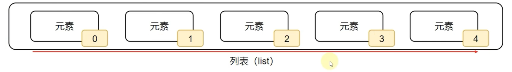
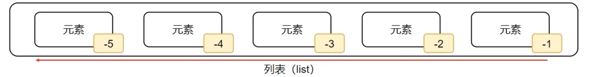
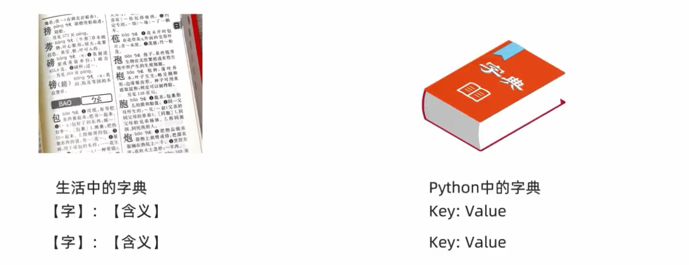

# Python 数据容器


## 1. 数据容器的入门

### 1.1 初始数据容器

变量是最基本的数据，但是如果我们想要100个数据，就需要创建100个变量，高级但低效。

```python
name1 ='王丽红'
name2 ='周杰轮' 
name3 ='林俊节'
name4 ='张学油' 
name5 ='刘德滑'
```

我们可以用一个变量储存多个值，这样的变量就是数据容器。

```python
nameList 二 ['王丽红'，'周杰轮'，'林俊节'，'张学油'，'刘德滑'] print(nameList)
```

这样储存数据优雅切高效。

这就是数据容器，一个容器可以容纳多份数据。

### 1.2数据容器

Python中的数据容器：

一种**可以容纳多份数据**的数据类型，容纳的每**一份数据称之为1个元素**。


每一个元素，可以是任意类型的数据，如字符串、数字、布尔等。

数据容器根据特点的不同，如：

- 是否支持重复元素

- 是否可以修改

- 是否有序，等

分为5类，分别是：

**列表（list）**、**元组（tuple）**、**字符串（str）**、**集合(set）**、**字典 (dict)**


## 2. 数据容器：list(列表）

### 2.1 列表的定义

```python
#字面量
[元素1，元素2，元素3，元素4，...]

#定义变量
变量名称=[元素1，元素2，元素3，元素4，...]

# 定义空列表
变量名称=[]
变量名称 = 1ist()
```

列表内的**每一个数据，称之为元素**

- 以`[]`作为标识
- 列表内每一个元素之间用，逗号隔开

> **注意：**列表可以一次存储多个数据，且可以为不同的数据类型，支持嵌套。

### 2.2 列表的下标索引

#### 2.2.1 列表的下标(索引)

我们可以通过下标索引来取出列表中特定位置的数据。



我们可以通过`listName[x]`的方式来调用列表中的单个数据（索引是从0开始的）。

#### 2.2.1 列表的下标(索引) - 反向

也可以反向索引，也就是从后向前：从-1开始，依次递（-1、-2、-3...）



`listName[-x]`即，从后向前调用(反向索引是从-1开始的)。

#### 2.2.3 嵌套列表的下标(索引)

如果列表是嵌套的列表，同样支持下标索引


`listName[x][y]`即，调用索引为x的列表中索引为y的元素。

### 2.3 列表的常用操作

列表除了可以：

- 定义

- 使用下标索引获取值

以外，列表也提供了一系列功能：

- 插入元素

- 删除元素

- 清空列表

- 修改元素

- 统计元素个数

等等功能，这些功能我们都称之为：**列表的方法**

#### 2.3.1 方法的概念

在Python中，如果将函数定义为class（类）的成员，那么函数会称之为：方法。

方法和函数功能一样，有传入参数，有返回值，只是方法的使用格式不同：

- 函数的使用：`num = add (1, 2)`

- 方法的使用：`num = student.add(1, 2)`

#### 2.3.2 index方法

查找某元素的下标

- 功能：查找指定元素在列表的下标，如果找不到，报错ValueError

- 语法：列表.index(元素）

- > index就是列表对象（变量）内置的方法（函数）

#### 2.3.3 修改元素

- 修改特定位直（索引的元素值)：

  - 语法：列表[下标]=值

  -  可以使用如上语法，直接对指定下标（正向、反向下标均可）的值进行：重新赋值（修改）

- 插入元素

  - 在指定的下标位置，插入指定的元素
  - 语法：列表.insert(下标，元素）

- 追加元素

  - 语法1：列表.append(元素），将指定元素，追加到列表的尾部
  - 语法2：列表.extend(其它数据容器)，将其它数据容器的内容取出，依次追加到列表尾部

#### 2.3.4 删除元素

- 语法1：del 列表[下标]
- 语法2：列表.pop(下标)
- 删除某元素在列表中的第一个匹配项
  - 语法：列表.remove(元素)
- 清空列表内容，语法：列表.clear()


## 3. list（列表）的遍历

既然数据容器可以存储多个元素，那么，就会有需求从容器内依次取出元素进行操作。

将容器内的元素依次取出进行处理的行为，称之为：遍历、迭代。

### 3.1 while循环遍历列表

```python
index = 0
myList = [1, 2, 3, 4]
while index < len(myList):
  元素 = 列表[index]
  对元素进行处理
  index += 1
```

### 3.2 for循环遍历列表

```python
myList = [1, 2, 3, 4]
for element in myList:
  元素 = 列表[element]
  对元素进行处理
```

> while循环和for循环，都是循环语句，但细节不同：
>
> - 在循环控制上：
>   - while循环**可以自定循环条件**，并自行控制
>   - for循环**不可以自定循环条件**，只可以一个个从容器内取出数据
>
> - 在无限循环上：
>
>   - while循环**可以**通过条件控制做到无限循环
>
>   - For循环理论上**不可以**，因为被遍厉的容器蓉量不是无限的
>
> - 在使用场景上：
>
>   - whle循环适用于任何想要循环的场景
>
>   - for循环适用于，遍历数据容器的场景或简单的固定次数循环场景


## 4. 数据容器：tuple（元组）

列表是**可以修改**的，如果想要传递信息，**不被篡改**，列表就不合适了。

元组同列表一样，都是可以封装多个、不同类型的元素在内。

最大的不同点在于：**元素一旦定义，就不可以修改。**

### 4.1 元组的定义格式

元组定义：定义元组使用小括号，且使用逗号隔开各个数据，数据可以是不同的数据类型。

```python
变量名称 = (元素，元素，...，元素）
```

> #### **注意：**
>
> 如果元组中只有一个元素，需要在元素后加一个`，`，否则其类型就是当前元素的类型。
>
> 如果在元组中嵌套了一个列表，那么这个列表是可以修改的。

### 4.2 元组的特点

经过上述对元组的学习，可以总结出列表有如下特点：

- 可以容纳多个数据

- 可以容纳不同类型的数据（混装）

- 数据是有序存储的（下标索引）

- 允许重复数据存在

- **不可以修改**（增加或删除元素等）

- 支持for循环


多数特性和list一致，不同点在于不可修改的特性。

### 4.3 元组的常见操作

- index()    查找某个数据，如果数据存在返回对应的下标，否则报错
- count()    统计某个数据在当前元组出现的次数
- len(元组)  统计元组内的元素个数

## 5. 数据容器：str（字符串）

字符串是字符的容器，一个字符串可以存放任意数量的字符。

- 字符串的替换

  - 语法：字符串.replace(字符串1，字符串2） 

  - 功能：将字符串内的全部： 字符串1 替换为序符串2 

  - 注意：不是修改字符串本身，而是得到了一个新字符串哦

- 字符串的分割

  - 语法：字符串.split(分隔符字符串）

  - 功能：按照指定的分隔符字符串，将字符串划分为多个字符串，并存入列表对象中

  - 注意：**字符串本身不变，而是得到了一个列表对象**

- 字符串的规整操作

  - 去前后空格 

    - 语法：字符串.strip()

  - 去前后指定字符串 

    - 语法：字符串.strip(字符串）
    - 注意：传入的字符串会分割为字符，然后取出所有相同的字符。

    

## 6. 数据容器（序列）的切片

### 6.1 序列

序列是指：内容连续、有序，可使用下标索引的一类数据容器。

**列表、元组、字符串，均可以可以视序列。**


### 6.2 切片

序列支持切片，即：列表、元组、字符串，均支持进行切片操作；

切片：从一个序列中，取出一个子序列。

语法：序列[起始下标:结束下标:步长]


## 7. 数据容器：set（集合）

通过特性来分析：

- 列表可修改、支持重复元素且有序
- 元组、字符串不可修改、支持重复元素且有序

```python
# 定义集合字面量
my_set = {"H", "e", "l", "l", "o"}

# 定义空集合
my_set = ()
my_set = dict()
```

### 7.1 集合常用操作

首先，因为集合是无序的，所以集合**不支持：下标索引访问**

但是集合和列表一样，是允许修改的，所以我们来看看集合的修改方法。

- 添加新元素
  - 语法：集合.add(元素)。将指定元素，添加到集合内。
  - 结果：本身被修改，添加了新元素。
- 删除元素
  - 语法：集合.remove(元素)。将指定元素，从集合内移除。
  - 结果：集合本身被修改，移除了元素
- 取出两个集合的差集
  - 语法：集合1.difference(集合2），功能：取出集合1和集合2的差集（集合1有而集合2没有的）
  - 结果：得到一个新集合，集合1和集合2不变
- 2个集合合并
  - 语法：集合1.unior(集合2）
  - 功能：将集合1和集合2组合成新集合结果：得到新集合，集合1和集合2不变
  - 结果：得到新集合，集合1和集合2不变

经过上述对集合的学习，可以总结出集合有如下特点：

- 可以容纳多个数据

- 可以容纳不同类型的数据（混装）

- **数据是无序存储的（不支持下标索引）**
- **不允许重复数据存在**

- 可以修改（增加或删除元素等）

- 支持for循环


## 8. 数据容器：dict(字典、映射）

### 8.1 字典的定义



字典的定义，同样使用0，不过存储的元素是一个个的：健值对，如下语法：

```python
# 定义字典字面量
{key: value, key: value, ... , key: value}

# 定义空字典
my_dict = {}
my_dict = dict()
```

### 8.2 字典的基本操作

- 新增元素

  - 语法：字典(Keyl=Value，结果：字典被修改，新增了元素。

- 更新元素

  - 语法：字典[Keyl= Value，结果：字典被修改，元素被更新。
  - 注意：**字典Key不可以重复，所以对已存在的Key执行上述操作，就是更新Value值**。

- 获取全部的key

  - 语法：字典.keys()，结果：得到字典中的全部Key。

  ```python
  my_dict = {key1: value1, key2: value2, key3: value3}
  my_key = my_dict.keys()
  ```

  

## 9. 数据容器的通用操作

### 9.1 数据特性总结

数据容器可以从以下视角进行简单的分类：

- 是否支持下标索引

  - **支持：列表、元组、字符串 - 序列类型**
  - **不支持：集合、字典- 非序列类型**

- 是否支持重复元素：

  - **支持：列表、元组、字符串- 序列类型**
  - **不支持：集合、字典- 非序列类型**

- 是否可以修改

  - **支持：列表、集合、字典**

  - **不支持：元组、字符串**


1. 基于各类数据容器的特点，它们的应用场景如下：

- 列表：一批数据，可修改、可重复的存储场景

- 元组：一批数据，不可修改、可重复的存储场：

- 字符串：一串字符串的存储场景

- 集合：一批数据，去重存储场景

- 字典：一批数据，可用Key检索Value的存储场景

### 9.2 数据容器的通用操作

sorted() –> 取反

 