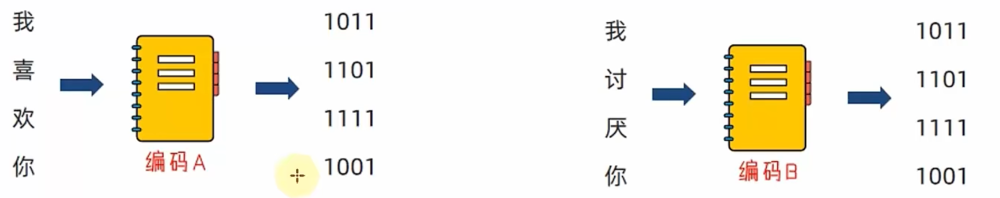

# Python 文件操作


## 1. 文件的编码

思考：计算机只能识别：0和1，那么我们丰富的文本文件是如何被计算机识别，并存储在硬盘中呢？

答案：使用编码技术（密码本） 将内容翻译成0和1存入。

编码技术即：翻译的规则，记录了如何将内容翻译成二进制，以及如何将二进制翻译回可识别内容。


计算机中有许多可用编码：

- UTF-8

- GBK

- Big5…

不同的编码，将内容翻译成二进制也是不同的。

编码有许多，所以要使用正确的编码，才能对文件进行正确的读写操作呢。



如上，如果你给喜欢的女孩发送文件，使用编码A进行编码（内容转二进制）。

女孩使用编码B打开文件进行解码（二进制反转回内容），自求多福吧。


## 2. 文件的读取

### 2.1 文件操作概述

#### 2.1.1 什么是文件

内存中存放的数据在计算机关机后就会消失。要长久保存数据，就要使用硬盘、光盘、U 盘等设备。为了便于数据的管理和检索，引入了“**文件**”的概念。

内存中存放的数据在计算机关机后就会消失。要长久保存数据，就要使用硬盘、光盘、U 盘等设备。为了便于数据的管理和检索，引入了“文件”的概念、

**一篇文章、一段视频、一个可执行程序，都可以被保存为一个文件，并赋予一个文件名。**操作系统以文件为单位管理磁盘中的数据。一般来说，文件可分为**文本文件、视频文件、音频文件、图像文件、可执行文件等多种类别**。

#### 2.1.2 文件操作包含的内容

在日常生活中，文件操作主要包括**打开、关闭、读、写**等操作。

#### 2.1.3 文件的操作步骤

息想我们平常对文件的基本操作，大概可以分为三个步骤：

1. 打开文件

2. 读写文件

3. 关闭文件

> #### **注意：**
>
> 可以只打开和关闭文件，不进行任何读写

### 2.2 open()函数

在Python, 使用open函数，可以打开一个己经存在的文件，或者创建一个新文件，语法如下：

```python
open(name,mode,encoding)
```

- name：是要打开的目标文件名的字符串(可以包含文件所在的具体路径)。

- mode：设置打开文件的模式(访问模式)：只读、写入、追加等。
  - r（只读模式）：以只读方式打开文件。文件的指针将会放在文件的开头。这是默认模式。
  - w（写入模式）：打开一个文件只用于写入。如果该文件已存在则打开文件，并从开头开始编辑，**原有内容会被删除**；如果该文件**不存在，创建新文件**。
  - a（追加模式）：
  - 打开一个文件用于追加。如果该文件已存在，**新的内容将会被写入到已有内容之后**；如果该文件**不存在，创建新文件**进行写入。


- encoding：编码格式（推荐使用UTF-8）

> #### **注意：**
>
> 此时的促`open`函数的这件对象，对象是Python中一种特殊的数据类型，拥有属性和方法，可以使用对象.属性或对象.方法对其进行访问，后续面向对象课程会给大家进行详细的介绍。

### 2.3 read()、redlines()方法

###### **read()方法：**

```python
文件对象.read(num)
```

num表示要从文件中读取的数据的长度（单位是字节），如果没有传入num，那么就表示读取文件中所有的数据。

> #### **注意：**
>
> 如果在同一个open中调用多次read()方法，那么下一次read()会从上一次read()的结尾处开始读取（readlines()方法同理）。

###### **readlines()方法**

readlines可以按照行的方式把整个文件中的内容进付一次性读取，并且返回的是一个**列表**，其中每一行的数据为一个元素。

```python
f= open('python.txt')
content = f.readlines()

# ['hello worldin','abcdefgin','aaaln', "bbbin', 'ccc']
print(content)

#关闭文件
f.close()
```

`readline()`方法调用一次读取一行文件。

> 可以用for循环遍历整个列表

### 2.4 close()函数

```python
文件.close()
```

### 2.5 with open语句

```python
with open(name, mode, encoding) as f:
  ...
```

与`open()`不同的是`with open()`会自动关闭文件。


## 3. 文件的写入

```Python
# 打开文件
f = open('python.txt','w')

# 文件写入
f.write('hello world')

# 内容刷新
f.flush()
```

> #### **注意：**
>
> - 直接调用write，内容并未真正写入文件，而是会积攒在程序的内存中，称之为缓冲区
> - 当调用flush的时候，内容会真正写入文件
> - 这样做是避免频繁的操作硬盘，导致效率下降（攒一堆，一次性写磁盘）


## 4. 文件的追加

```python
# 打开文件
f.open('python.txt', 'a')

# 文件写入
f.write('hello world')

# 内容刷新
f.flush()
```

> #### **注意：**
>
> - a模式，文件不存在会创建文件
> - a模式，文件存在会在最后，追加写入文件


# 第九章 Python异常、模块与包


## 1. 了解异常

### 1.1 什么是异常

当检测到一个错误时，Python解释器就抚法继续执行了反而出现了一些话误的提示，这就是所谓的“异常”， 也就是我们常说的BUG。


### 1.2 bug单词的诞生

**早期计算机采用大量继电器工作，马克二型计算机就是这样的。**

1945年9月9日，下午三点，马克二型计算机无法正常工作了，技术人员试了很多办法，最后定位到第70号继电器出错。负责人哈珀观察这个出错的继电器， 发现一只飞蛾躺在中间，已经被继电器打死。她小心地用摄子将蛾子夹出来，用透明胶布帖到”事件记录本〞中，并注明”第一个发现虫子的实例。”自此之后，引发软件失效的缺陷，便被称为Bug。


## 2. 异常的捕获方法

### 2.1 为什么捕获异常

世界上没有完美的程序，任何程序在运行的过程中，都有可能出现：异常，也就是出现bug 导致程序无法完美运行下去。

我们要做的，不是力求程序完美运行。

而是在力所能及的范围内，对可能出现的bug，进行提前准备、提前处理。

这种行为我们称之为：**异常处理（捕获异常）**

当我们的程序遇到了**BUG**，那么接下来有两种情况：

1. **整个程序因为一个BUG停止运行**

2. **对BUG进行提醒，整个程序继续运行**

显然在之前的学习中，我们所有的程序**遇到BUG**就会出现**①的这种情况**，也就是整个程序直接奔溃.

但是在真实工作中，我们肯定不能因为一个小的BUG就让整个程序全部奔溃，也就是我们希望的是达到②的这种情况那这里我们就需要使用到**捕获异常**

**捕获异常的作用在于：提前假设某处会出现异常，做好提前准备，当真的出现异常的时候，可以有后续手段。**

### 2.2 捕获异常操作

#### 2.2.1 捕获常规异常

基本语法：

```python
try:
  可能发生错误的代码
except:
  如果出现异常执行的代码
```

> #### **注意：**
>
> 1. 如果尝试执行的代码的异常类型和要捕获的异常类型不一致，则无法捕获异常。
> 2. 一般try下方只放一行尝试执行的代码。

#### 2.2.2 捕获指定异常

基本语法：

```python
try:
    print(name)
except NameError as e:
    print('name变量名称未定义错误')
```

> #### **注意：**
>
> 1. 如果尝试执行的代码的异常类型和要捕获的异常类型不一致，则无法捕获异常。
> 2. 一般try下方只放一行尝试执行的代码。

#### 2.2.3 捕获多个异常

基本语法：

```python
try:
    print(1/0)
except (NameError, ZeroDivisionError):
    print('ZeroDivision错误...')
```

#### 2.2.4 捕获所有异常

```python
try:
    print(name)
except Exception as e:
    print(e)
```

#### 2.2.5 异常的else和finally语法

```python
# else
try:
    print(1)
except Exception as e:
    print(e)
else:
    print('我是else，是没有异常的时候执行的代码')

# finally
try:
    f = open('test.txt', 'r')
except Exception as e:
    f = open('test.txt', 'w')
else:
    print('没有异常，真开心')
finally:
    f.close()
```

- else：未出现异常时执行
- finally：无论是否异常都执行


### 3. 异常的传递

异常是具有传递性的

当函数func01中发生异常, 并且没有捕获处理这个异常的时候, 异常会传递到函数func02, 当func02也没有捕获处理这个异常的时候main函数会捕获这个异常,  这就是**异常的传递性**.


> 提示:    **当所有函数都没有捕获异常的时候, 程序就会报错**


## 4. Python模块

### 4.1 模块的导入

#### 4.1.1 什么是模块

Python **模块**（(Module)，是一个 **Python 文件**，**以.py 结尾**．模块能定义函数，类和变量，模块里也能包含可执行的代码.

**模块的作用：**python中有很多各种不同的模块，每一个模块都可以帮助我

们快速的实现一些**功能**，比如实现和时间相关的功能就可以使用time模块

我们可以认为**一个模块**就是**一个工具包**，每一个工具包中都有各种不同的工具供我们使用进而实现各种不同的功能.

大白话：模块就是一个Python文件，里面有类、函数、变量等，我们可以

拿过来用（导入模块去使用）

#### 4.1.2 模块的导入方式

模块在使用前需要先导入导入的语法如下：

```python
[from 模块名] import [模块 | 类 | 变量 | 函数 | *] [as 别名]
```

**常用的组合形式如：**

- import 模块名

- from 模块名 import 类、变量、方法等
- from 模块名 import *

- import 模块名 as 别名

- from 模块名 import 功能名 as 别名

### 4.2 自定义模块

#### 4.2.1 制作自定义模块

Python中己经帮我们实现了很多的模块．不过有时候我们需要一些**个性化的模块**，这里就可以通过**自定义模块实现**，也就是自己制作一个模块。

#### 4.2.2 __ main __

```python
def text(a, b):
  print(a + b)
  
# 在模块内部会运行，但是在外部导入模块时不会被调用
if __name__ == '__main__':
  test(1, 2)
```

#### 4.2.3 __ all __

 ```python
from my_module import * # 调用模块内的全部函数

# __all__ = ['test_A'] #
from my_module import * # 调用模块内的test_A函数
 ```


## 5. Python包

### 5.1 自定义包

**从物理上看**，包就是一个**文件夹**，在该文件夹下包含了一个 `_init_.py` 文件，该文件夹可用于包含多个**模块文件从逻辑上看**，包的本质依然是**模块**。


**包的作用：**

当我们的模块文件越来越多时，包可欧帮助我们管理这些模块，包的作用就是包含多个模块，但包的本质依然是模块。

### 5.2 导入包

```python
import 包名.模块名

from 包名 import 模块名
```


### 5.2 安装第三方包

我们知道，包可以包含一堆的Python模块，而每个模块又内含许多的功能。

所以，我们可以认为：一个包，就是一堆同类型功能的集合体。

在Python程序的生态中，有许多非常多的第三方包（非Python官方），可以极大的帮助我们提高开发效率，如：

- 科学计算中常用的：numpy包
- 数据分析中常用的：pandas包
- 大数据计算中常用的：pyspark、apache-flink包
- 图形可视化常用的：matplotlib、pyecharts
- 人工智能常用的：tensorflow等

这些第三方的包，极大的丰富了Python的生态，提高了开发效率。但是由于是第三方，所以Python没有内置，所以我们需要安装它们才可以导入使用哦。

#### 安装

```bash
pip install 包名称
```

