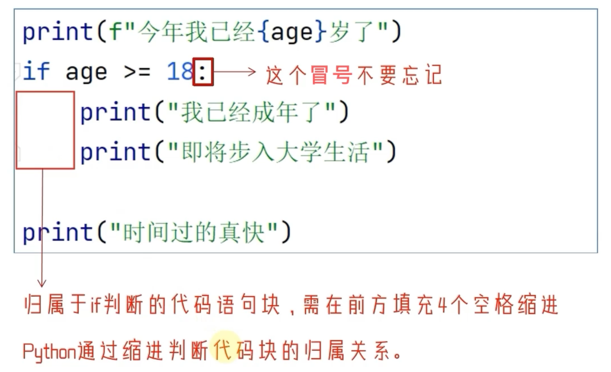
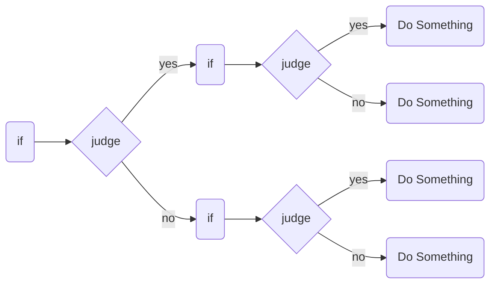

# Python判断语句


进行逻辑判断，是生活中常见的行为。同样，在程序中，进行逻辑判断也是最为基础的功能。


## 1. 布尔类型和比较运算符

### 1.1 布尔类型的定义

布尔类型的字面量：

- True 表示真（肯定）
- False 表示假（否定）

可以使用比较运算符进行比较运算得到布尔类型的结果。

### 1.2 比较运算符

数学运算中的比较运算符，用法一致。

表达式：`操作数1 比较运算符 操作数2 = true/false`


## 2. if语句

### 2.1 if语句的基本格式

```python
if 逻辑表达式:
  语句 # 条件成立则运行此语句
```

#### 注意



### 2.2 if else语句

```python
if 表达式:
  statement1 # 表达式为true则执行此语句
else:
  statement2 # 表达式不为true则执行此语句
```

#### 注意


### 2.3 if elif else 语句

```python
if 表达式1:
  statement1 # 表达式1为true则执行此语句
elif 表达式2:
  statement2 # 表达式2为true则执行此语句
elif 表达式3:
  statement3 # 表达式3为true则执行此语句
else:
  statement4 # 表达式x不为true则执行此语句
```

#### 注意


## 3. 判断语句的嵌套



许多逻辑的判断，是嵌套的，多层次的。

对于这种需求，我们可以：自由组合if elif else中完成特定需求的要求。

> 通过缩进来表达if语句的嵌套和所属关系。
