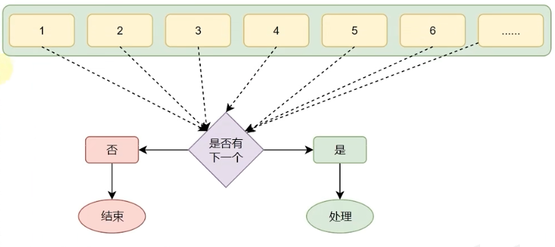

# Python循环语句


循环普遍存在于日常生活中，同样，在程序中，循环功能也是至关重要的基础功能。


## 1. while语句

### 1.1 while循环的基础语法

```python
while 条件:
  Statement1 # 条件成立，则执行此语句
```

如果条件成立则执行语句，直到条件不成立为止。

#### 案例

1. 我们制作一个自动攻击的AI：

```python
int AIBlood = 100
while AIBlood > 0:
  printf("血量-1")
  AIBlood -= 1
print("He's died")
```

每次执行循环体时`AIBlood`变量都会-1，直到血量为0时，终止循环。输出`AI死亡`。

> 一定要在循环中对循环数进行操作，来控制循环次数。如果不处理循环变量的值，此循环则会一直循环，即进入死循环。

2. 我们求1-100的和

```python
int num = 1
int recode = 0

while num <= 100:
  recode += num
  num += 1
print(recode)
```

### 1.2 while嵌套循环

```Python
while 条件1:
  条件1满足时，做的事情1 
	条件1满足时，做的事情2 
	条件1满足时，做的事情3
	...（省略）...
	while 条件2：
		条件2满足时，做的事情1 
    条件2满足时，做的事情2 
    条件2满足时，做的事情3
		...（省略）...
```

#### 案例

```python
i = 1
while i <= 100:
  print("今天是第{i}天，准备表白……")
  j = 1
  while j <= 10:
    print("送给小美第{i}朵玫瑰花")
    j += 1
  print("小美，我喜欢你")
  i += 1
print("坚持到第{i-1}天，表白成功")
```


## 2. for循环

### 2.1 for循环的基础语法

#### 2.1.1 基础语法

除了while循环语句外，Python同样提供了for循环语句。

两者能完成的功能基本差不多，但仍有一些区别：

- while循环的循环条件是自定义的，自行控制循环条件
- for循环是一种〞轮询〞机制，是对一批内容进行〞逐个处理"
- 

程序中的for循环：

```python
for 临时变量 in 待处理数据集:
  循环满足条件时执行的代码
```

> 同while循环不同，for循环是无法定义循环条件的。只能从被处理的数据集中，依次取出内容进行处理。
>
> 所以，理论上讲，Python的for循环无法构建无限循环（被处理的数据集不可能无限大）

#### 2.1.2 range语句

1. **语法1:**

`range(num)`

获取一个从0开始，到num结束的数字序列（不含num本身）

eg. range(5)取得的数据是：[0, 1, 2, 3, 4]

2. **语法2:**

`range(num1, num2)`

获得一个从num1开始，到num2结束的数字序列（不含num2本身） 

eg. range(5， 10)取得的数据是：[5, 6, 7, 8, 9]

3. **语法3:**

`range(num1, num2, step)`

获得一个从num1开始，到num2结束的数子序列（不含num2本身） 

数字之间的步长，以step为准（step默认为1）

eg. range(5, 10, 2)取得的数据是：[5, 7, 9]

#### 2.1.3 变量作用域

变量只在初始化时的作用域中起作用。

### 2.2 for循环的嵌套

```Python
for 临时变量 in 待处理数据集（序列）:
  循环满足条件应做的事情1
  循环满足条件应做的事情2
  循环满足条件应做的事情N
  ...
  for 临时变量 in 待处理数据集(序列）:
    循环满足条件应做的事情1 
    循环满足条件应做的事情2 
    循环满足条件应做的事情N
```

#### 案例

**输出九九乘法表：**

```python
for i in range(1, 10):
  for j in range(1, i + 1):
    print(f"{j} * {i} = {j*i}\t", end=' ')
  print()
```


## 3. break 和 continue

在这个重复的过程中，会出现一些其它情况让我们不得不：

- 暂时跳过某次循环，直接进行下一次

- 提前退出循环，不在继续

对于这种场景，Python提供continue和break关键字用以对循环进行**临时跳过**和**直接结束**。

### 3.1 continue

continue关键字用于：**中断本次**循环，直接**进入下一次**循环 

continue可以用于：for循环、while循环

> ```python
> for i in range(1, 100):
>   	语句1
>   	continue
>   	语句2
> ```
>
> - 在循环内，遇到continue就结束当次循环，进行下一次；
> - 所以，语句2是不会执行的。

### 3.2 break

break关键字用于：直接结束循环

break可以用于： for循环和while循环，效果一致

> ```python
> for i in range(1, 100):
>   语句1
>   break
>   语句2
> 语句三
> ```
>
> - 在循环内，遇到break就结束循环了；
>
> - 所以，执行了语句1后，直接执行语句3了。
