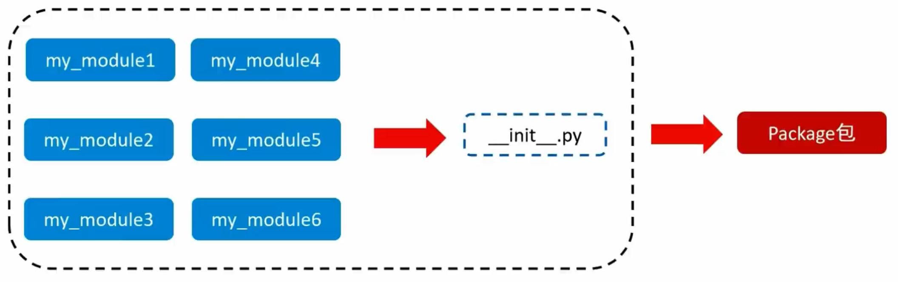

# Python异常、模块与包


## 1. 了解异常

### 1.1 什么是异常

当检测到一个错误时，Python解释器就抚法继续执行了反而出现了一些话误的提示，这就是所谓的“异常”， 也就是我们常说的BUG。


### 1.2 bug单词的诞生

**早期计算机采用大量继电器工作，马克二型计算机就是这样的。**

1945年9月9日，下午三点，马克二型计算机无法正常工作了，技术人员试了很多办法，最后定位到第70号继电器出错。负责人哈珀观察这个出错的继电器， 发现一只飞蛾躺在中间，已经被继电器打死。她小心地用摄子将蛾子夹出来，用透明胶布帖到”事件记录本〞中，并注明”第一个发现虫子的实例。”自此之后，引发软件失效的缺陷，便被称为Bug。


## 2. 异常的捕获方法

### 2.1 为什么捕获异常

世界上没有完美的程序，任何程序在运行的过程中，都有可能出现：异常，也就是出现bug 导致程序无法完美运行下去。

我们要做的，不是力求程序完美运行。

而是在力所能及的范围内，对可能出现的bug，进行提前准备、提前处理。

这种行为我们称之为：**异常处理（捕获异常）**

当我们的程序遇到了**BUG**，那么接下来有两种情况：

1. **整个程序因为一个BUG停止运行**

2. **对BUG进行提醒，整个程序继续运行**

显然在之前的学习中，我们所有的程序**遇到BUG**就会出现**①的这种情况**，也就是整个程序直接奔溃.

但是在真实工作中，我们肯定不能因为一个小的BUG就让整个程序全部奔溃，也就是我们希望的是达到②的这种情况那这里我们就需要使用到**捕获异常**

**捕获异常的作用在于：提前假设某处会出现异常，做好提前准备，当真的出现异常的时候，可以有后续手段。**

### 2.2 捕获异常操作

#### 2.2.1 捕获常规异常

基本语法：

```python
try:
  可能发生错误的代码
except:
  如果出现异常执行的代码
```

> #### **注意：**
>
> 1. 如果尝试执行的代码的异常类型和要捕获的异常类型不一致，则无法捕获异常。
> 2. 一般try下方只放一行尝试执行的代码。

#### 2.2.2 捕获指定异常

基本语法：

```python
try:
    print(name)
except NameError as e:
    print('name变量名称未定义错误')
```

> #### **注意：**
>
> 1. 如果尝试执行的代码的异常类型和要捕获的异常类型不一致，则无法捕获异常。
> 2. 一般try下方只放一行尝试执行的代码。

#### 2.2.3 捕获多个异常

基本语法：

```python
try:
    print(1/0)
except (NameError, ZeroDivisionError):
    print('ZeroDivision错误...')
```

#### 2.2.4 捕获所有异常

```python
try:
    print(name)
except Exception as e:
    print(e)
```

#### 2.2.5 异常的else和finally语法

```python
# else
try:
    print(1)
except Exception as e:
    print(e)
else:
    print('我是else，是没有异常的时候执行的代码')

# finally
try:
    f = open('test.txt', 'r')
except Exception as e:
    f = open('test.txt', 'w')
else:
    print('没有异常，真开心')
finally:
    f.close()
```

- else：未出现异常时执行
- finally：无论是否异常都执行


### 3. 异常的传递

异常是具有传递性的

当函数func01中发生异常, 并且没有捕获处理这个异常的时候, 异常会传递到函数func02, 当func02也没有捕获处理这个异常的时候main函数会捕获这个异常,  这就是**异常的传递性**.


> 提示:    **当所有函数都没有捕获异常的时候, 程序就会报错**


## 4. Python模块

### 4.1 模块的导入

#### 4.1.1 什么是模块

Python **模块**（(Module)，是一个 **Python 文件**，**以.py 结尾**．模块能定义函数，类和变量，模块里也能包含可执行的代码.

**模块的作用：**python中有很多各种不同的模块，每一个模块都可以帮助我

们快速的实现一些**功能**，比如实现和时间相关的功能就可以使用time模块

我们可以认为**一个模块**就是**一个工具包**，每一个工具包中都有各种不同的工具供我们使用进而实现各种不同的功能.

大白话：模块就是一个Python文件，里面有类、函数、变量等，我们可以

拿过来用（导入模块去使用）

#### 4.1.2 模块的导入方式

模块在使用前需要先导入导入的语法如下：

```python
[from 模块名] import [模块 | 类 | 变量 | 函数 | *] [as 别名]
```

**常用的组合形式如：**

- import 模块名

- from 模块名 import 类、变量、方法等
- from 模块名 import *

- import 模块名 as 别名

- from 模块名 import 功能名 as 别名

### 4.2 自定义模块

#### 4.2.1 制作自定义模块

Python中己经帮我们实现了很多的模块．不过有时候我们需要一些**个性化的模块**，这里就可以通过**自定义模块实现**，也就是自己制作一个模块。

#### 4.2.2 __ main __

```python
def text(a, b):
  print(a + b)
  
# 在模块内部会运行，但是在外部导入模块时不会被调用
if __name__ == '__main__':
  test(1, 2)
```

#### 4.2.3 __ all __

 ```python
 from my_module import * # 调用模块内的全部函数
 
 # __all__ = ['test_A'] #
 from my_module import * # 调用模块内的test_A函数
 ```


## 5. Python包

### 5.1 自定义包

**从物理上看**，包就是一个**文件夹**，在该文件夹下包含了一个 `_init_.py` 文件，该文件夹可用于包含多个**模块文件从逻辑上看**，包的本质依然是**模块**。



**包的作用：**

当我们的模块文件越来越多时，包可欧帮助我们管理这些模块，包的作用就是包含多个模块，但包的本质依然是模块。

### 5.2 导入包

```python
import 包名.模块名

from 包名 import 模块名
```


### 5.2 安装第三方包

我们知道，包可以包含一堆的Python模块，而每个模块又内含许多的功能。

所以，我们可以认为：一个包，就是一堆同类型功能的集合体。

在Python程序的生态中，有许多非常多的第三方包（非Python官方），可以极大的帮助我们提高开发效率，如：

- 科学计算中常用的：numpy包
- 数据分析中常用的：pandas包
- 大数据计算中常用的：pyspark、apache-flink包
- 图形可视化常用的：matplotlib、pyecharts
- 人工智能常用的：tensorflow等

这些第三方的包，极大的丰富了Python的生态，提高了开发效率。但是由于是第三方，所以Python没有内置，所以我们需要安装它们才可以导入使用哦。

#### 安装

```bash
pip install 包名称
```
