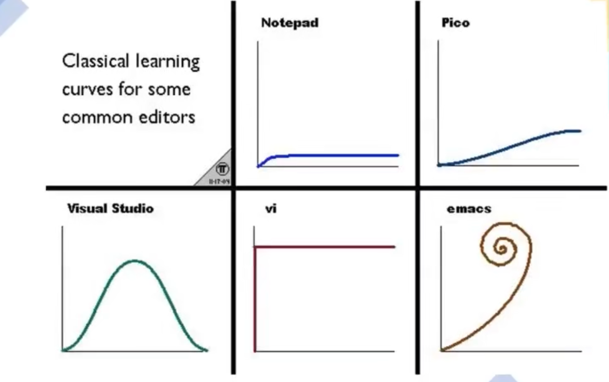

# Vim从0到1

## 1. Vim环境配置

### 1.1 Windows

可以在[Vim官网](https://www.vim.org)上下载gvim的安装包，然后双击执行。

### 1.2 Linux

用你所使用的发行版对应的包管理器安装即可。

#### 1.3 Mac

Mac自带vim。

## 2.Vim模式介绍

这张图可能你并不陌生，在各大论坛、贴吧、博客都有它的身影。我们可以看到vim的上手难度非常高，但是在你上手vim之后效率远超同级别的代码编辑器（emacs除外）。

### 2.1 正常模式

当我们在终端输入`vim`之后会进入一个黑色的编辑器，这就是vim，准确来说这是vim中的一种模式——“正常模式”。

正常模式是我们高效编辑的模式。在这个模式下我们无法输入文本，只能预览文本和复制、剪切、粘贴等操作。

#### 2.1.1 光标移动

- `hjkl`：hjkl对应的分别是光标左、下、上、右移动的操作。这和我们常规的编辑器不同，当然你也可以用↑、↓、←、→来移动光标，但是作为一名合格的Vimmer，这就是必修课。如果你适应之后，你会发现这四个键位简直太舒服了。
- 单词级跳转：
  - `w`:移动到下一个`word`开头
  - `W`:也是移动到下一个`WORD`开头 
  - `e`:移动到下一个`word`结尾，不在空行停留
  - `E`:移动到下一个`WORD`结尾 ，不在空行停留
  - `b`:移动到上一个`word`开头 
  - `B`:移动到上一个`WORD`开头 
  - `ge`:移动到上一个`word`结尾
  - `gE`:移动到上一个`WORD`结尾

> 大小写的区别：
>
> - 小写的只会跳转到下个单词但是如果单词之间有符号则会优先跳转到符号上。
>
> eg. 在`aaa@bbb`中，我们按下w键光标会跳转到@字符上，而不是b。
>
> - 大写`W`则会跳过符号（将符号视为字母）
>
> eg.在`aaa@bbb ccc`中，我们按下W键，光标会直接跳转到c字符上。

- 文本对象（text object）级移动
  - `(`，移动到上一个语句开头
  - `)`，移动到下一个语句开头 
  - `{`，移动到上一个段落开头
  - `}`，移动到下一个段落开头 
  - `H`，窗口第一行
  - `M`，窗口中间一行
  - `L`， 窗口最后一行
  - `gg`，跳转到文档开头 
  - `G`，跳转到文档结尾
  - `nG`，跳转到文档第n行

这里重点记住`G`、`gg`、`nG`即可。

- 文本编辑
  - `x`可以删除当前光标下的字符
  - `dd`和`cc`表示删除当前行